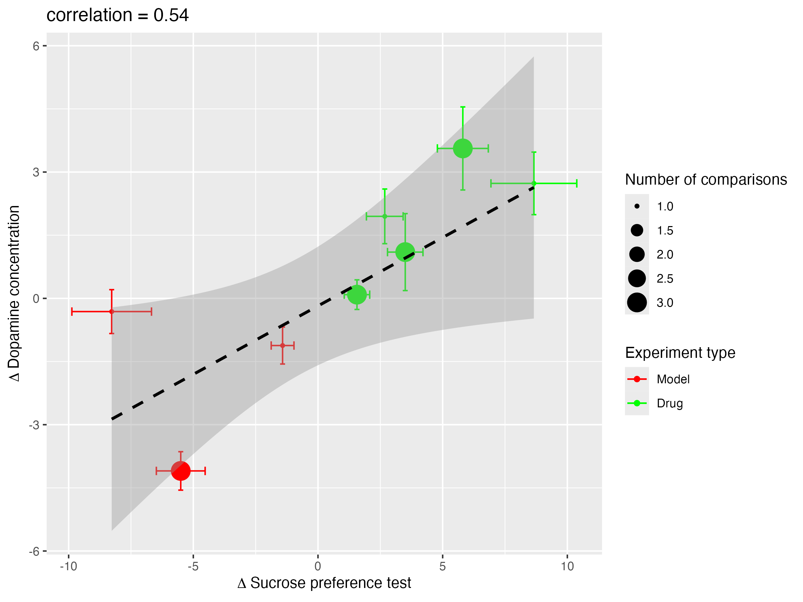
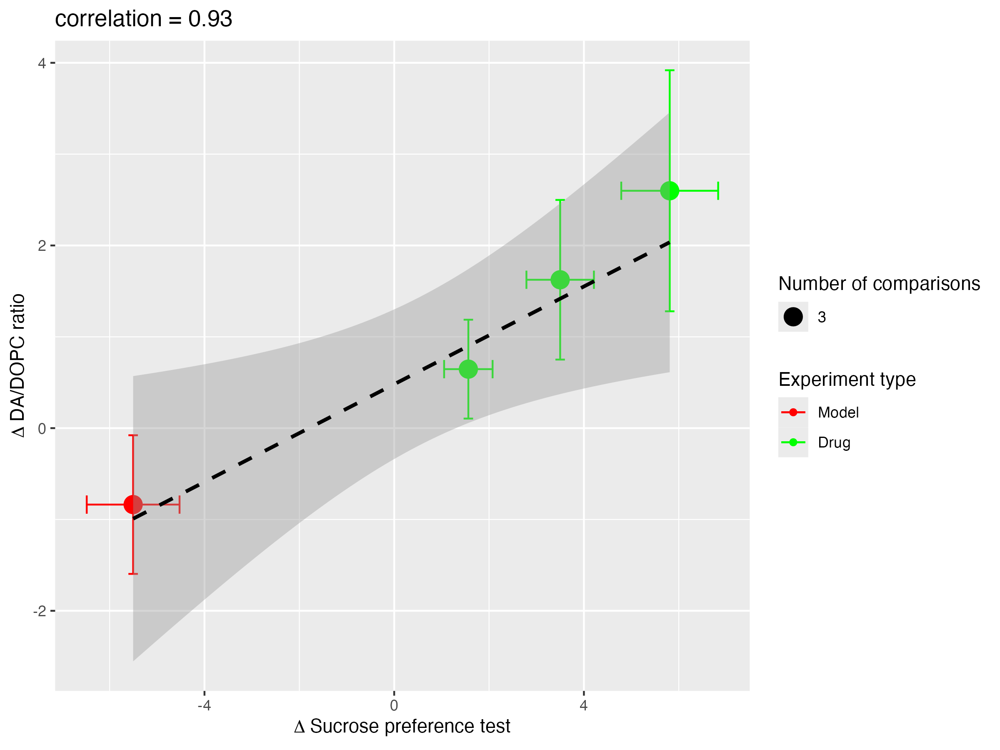
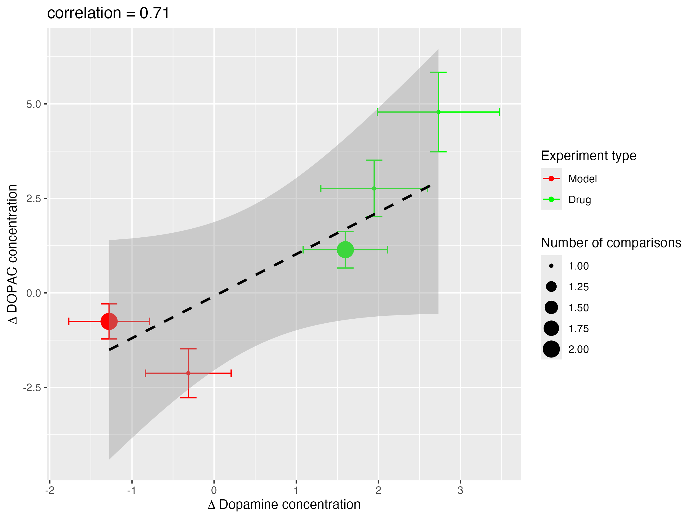
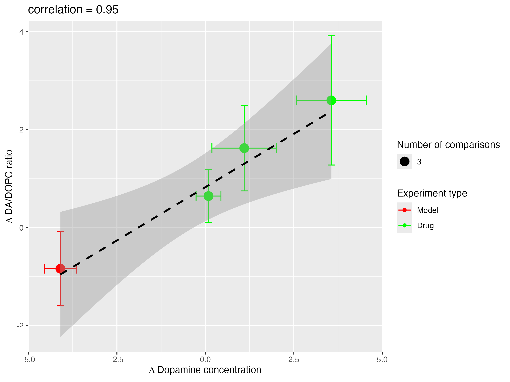

```{r setup, message=F, echo=F, include=F}
### libraries
library(devtools)
library(dosresmeta)
library(dplyr)
library(grid)
library(gtools)
library(kableExtra)
library(graphics)
library(patchwork)
library(forcats)
library(knitr)
library(ggplot2)
#library(Matrix)
library(meta)
library(metafor)
library(orchaRd)
library(readxl)
library(readr)
library(rje)
library(rms)
library(stringr)
library(tibble)
library(tidyr)
library(tools)
library(rlang)
#devtools::install_github("mcguinlu/robvis")
#install_github("mcguinlu/robvis")
library(robvis)
library(PRISMA2020)
library(grateful)
library(xtable)


#define LSR

LSR <- 'LSR1'
# define date of processing
DoP <- Sys.Date()


# All function needed to run this notebook (analyses, etc.) should be in a util.R file
source("util/util.R")

# obtain the data and prepare them for analysis - all data cleaning routines should be in this .R script 


source("wrangling/wrangling_functions.R", local = TRUE)
source("wrangling/data_wrangle_script.R")
source("util/development.R")

#Round off results to two digits
options(scipen=100, digits=3)

# Import data
file2load <- paste0(LSR,'_clean_data_',DoP,'.csv')
df <- read_csv(file2load)
```

# 1. Flow of study selection and descriptives

```{r article metadata, eval = TRUE, echo = FALSE}
# Retrieve article metadata omitted from 'clean_data.csv' and join 

article_metadata <- df %>% 
  select(StudyId, Title, Year) %>%
  distinct()
```

The flow of study selection is shown in Figure 1. Studies included were published between `r min(article_metadata$Year)` and `r max(article_metadata$Year)`. Overall, this analysis includes `r length(table(df$StudyId))` studies containing `r nrow(df)` comparisons.

**Figure 1**

```{r PRISMA flowchart, eval = TRUE, echo = FALSE, warning=FALSE, message=FALSE}
prisma_data <- read_csv("data/LSR1_prisma_290124.csv")
dfp <- PRISMA_data(prisma_data)
PRISMA_flowdiagram(dfp, interactive=FALSE, previous=FALSE, other=FALSE,
                    detail_databases=FALSE, detail_registers=FALSE, fontsize=12, font="Helvetica",
                    title_colour="Goldenrod1", greybox_colour="Gainsboro", main_colour="Black",
                    arrow_colour="Black", arrow_head="normal", arrow_tail="none", side_boxes=TRUE )
```

**Table 1** below gives a summary of the included studies for the effect of model induction. N represents an aggregate of animals contributing to outcomes reported from control and treatment groups, and if the same control group has contributed to more than one experiment, those animals will be counted more than once.

```{r Included studies, eval = TRUE, echo = FALSE, warning=FALSE, message=FALSE}
RoB <- unique(df[,c(4,6,12)])

#change studyId to Author, year
RoB$Study <- RoB$StudyId_I
RoB$StudyId <- toupper(paste0(str_extract(RoB$Authors_I,"\\b\\w+\\b"),', ',RoB$Year_I))

# fix >1 publication per first author in a year

# Assuming your data frame is named RoB and the column is named StudyId
unique_study_ids <- unique(RoB$StudyId)
suffix_list <- character(length = nrow(RoB))

for (study_id in unique_study_ids) {
  indices <- RoB$StudyId == study_id
  if (sum(indices) > 1) {
    suffix_list[indices] <- letters[seq_along(suffix_list[indices])]
  }
}

RoB$suffix <- suffix_list

# Add the suffix to the original column
RoB$StudyId <- paste(RoB$StudyId, RoB$suffix, sep = "")

# Remove the 'suffix' column if you no longer need it
RoB <- select(RoB, -suffix)
RoB <- RoB[order(RoB$StudyId),]

colnames(RoB) <- c('Study', 'Authors', 'Year', 'StudyId')

colnamesdf <- c('StudyId_I', 'Authors_I','Year_I','Strain', 'Label', 'outcome_type',
                'NumberOfAnimals', 'NumberOfAnimals_C', 'NumberOfAnimals_I', "DiseaseModelLabel(s)[1]_I", 'SortLabel')
df3 <- df[,colnamesdf]
df3$N <- as.numeric(df3$NumberOfAnimals_C) + as.numeric(df3$NumberOfAnimals_I)
df3$CompLable <- df3$Label

trow <- merge(df3, RoB, by.x = 'StudyId_I', by.y = 'StudyId')
colnames(trow)[17] <- "Id"
trowmodel <- subset(trow, trow$SortLabel == 'CvS')
trowint <- subset(trow, trow$SortLabel =='TvC')
tab1m <- trowmodel[,c(17,4,10,6,12)]
tab1i <- trowint[,c(17,4,10,5,6,12)]
tab2i <- tab1i %>%
  group_by(Id, `DiseaseModelLabel(s)[1]_I`, Strain, Label, outcome_type) %>%
  summarise(subjects_sum = sum(N))
tab2m <- tab1m %>%
  group_by(Id, `DiseaseModelLabel(s)[1]_I`, Strain, outcome_type) %>%
  summarise(subjects_sum = sum(N))


colnames(tab2i) <- c("Study", "Model", "Strain", "Comparison", "Outcome","N")
colnames(tab2m) <- c("Study", "Model", "Strain", "Outcome","N")

tab2m <- tab2m %>%
  arrange(Study, Model, Strain, Outcome)

tab2i <- tab2i %>%
  arrange(Study, Model, Strain, Comparison, Outcome)

write.csv(tab2i, 'tab2i.csv')
write.csv(tab2m, 'tab2m.csv')
```

```{r results="asis", echo = FALSE, warning=FALSE, message=FALSE}

tab2m <- read_csv("data/tab2m.csv")
tab2m$N <- as.numeric(tab2m$N)

original_data <- tab2m
# Rows to have bold lines beneath
rows_with_bold_lines <- c(1,4,5,6,7,8,10,11,12,13,14,15,16,18,20,23,24,25,27,30,31,32,33,34,35,38,39,40)

# Generate HTML table with adjusted styles
cat('<div style="text-align: center;">')
cat('<table style="width: 100%; border-collapse: collapse;">')

# Table header
cat('<tr style="border-bottom: 2px solid black;">')
for (col_name in names(original_data)) {
  cat(paste('<th style="padding: 8px; text-align: center;">', col_name, '</th>', sep = ''))
}
cat('</tr>')

# Table rows
for (i in seq_len(nrow(original_data))) {
  cat('<tr>')
  for (j in seq_len(ncol(original_data))) {
    cell_content <- original_data[i, j]
    cell_style <- ifelse(i %in% rows_with_bold_lines, 'border-bottom: 2px solid black; padding: 8px; text-align: center;', 'border-bottom: 1px solid black; padding: 8px; text-align: center;')
    if (j == 1) {
      cell_style <- gsub('text-align: center;', 'text-align: left;', cell_style)
    }
    if (i == nrow(original_data)) {
      cell_style <- gsub('border-bottom: 1px solid black;', 'border-bottom: 2px solid black;', cell_style)
    }
    cat(paste('<td style="', cell_style, '">', cell_content, '</td>', sep = ''))
  }
  cat('</tr>')
}

cat('</table>')
cat('</div>')


```

**Abbreviations**

iuGC - intra-uterine glucocorticoid: CMS - chronic mild stress: CUMS - chronic unpredictable mild stress: CUS - chronic unpredicatble stress: PNS - prenatal stress: Defeat - social defeat stress: TBI - traumatic brain injury: LPS - intraperitoneal lipopolysaccharide: MCAO - middle cerebral artery occlusion: WAG/Rij = genetic model of absence epilepsy with co-morbid depression

**Table 2** below gives a summary of the included studies for the effect of dopaminergic interventions. N represents an aggregate of animals contributing to outcomes reported from control and treatment groups, and if the same control group has contributed to more than one experiment, it will be counted twice.While some authors considered imipramine to have dopaminergic effects, we considered, given that this was a minor contribution to its pharmacological repertoire, that these studies should not be included in this iteration of the review.

```{r results="asis", echo = FALSE, warning=FALSE, message=FALSE}

tab2i <- read_csv("data/tab2i.csv")
tab2i$N <- as.numeric(tab2i$N)

original_data <- tab2i
# Rows to have bold lines beneath
rows_with_bold_lines <- c(3,6,9,10,11,12,14,16,17,18,19,20,23,25,27,30,33,39,40,41,42,44,45,54,55,56)

# Generate HTML table with adjusted styles
cat('<div style="text-align: center;">')
cat('<table style="width: 100%; border-collapse: collapse;">')

# Table header
cat('<tr style="border-bottom: 2px solid black;">')
for (col_name in names(original_data)) {
  cat(paste('<th style="padding: 8px; text-align: center;">', col_name, '</th>', sep = ''))
}
cat('</tr>')

# Table rows
for (i in seq_len(nrow(original_data))) {
  cat('<tr>')
  for (j in seq_len(ncol(original_data))) {
    cell_content <- original_data[i, j]
    cell_style <- ifelse(i %in% rows_with_bold_lines, 'border-bottom: 2px solid black; padding: 8px; text-align: center;', 'border-bottom: 1px solid black; padding: 8px; text-align: center;')
    if (j == 1) {
      cell_style <- gsub('text-align: center;', 'text-align: left;', cell_style)
    }
    if (i == nrow(original_data)) {
      cell_style <- gsub('border-bottom: 1px solid black;', 'border-bottom: 2px solid black;', cell_style)
    }
    cat(paste('<td style="', cell_style, '">', cell_content, '</td>', sep = ''))
  }
  cat('</tr>')
}

cat('</table>')
cat('</div>')


```

References of included studies are located in the appendix. Included studies used `r length(table(df$ModelID))` unique disease model induction procedures.

## 1.1 Description of experiment types and methodological approach

Within the literature we identified distinct categories of experiments and the data presented would allow several meta-analytic contrasts to be drawn:

**Effects of disease modelling**. These are experiments investigating the effect of models of depression, reported in `r nrow(df %>% filter(SortLabel == "CvS"))` experiments from `r nrow(df %>% filter(SortLabel == "CvS") %>% distinct(StudyId))` publications.

In these studies the:

-   **Control group** is a group of animals that is (1) not subjected to a depression model induction paradigm and (2) is administered a control treatment (vehicle) or no treatment.

-   **Intervention group** is a group of animals that is (1) subjected to a depression model induction paradigm and (2) is administered a control treatment (vehicle) or no treatment.

**Treatment vs control**. These were experiments investigating the effect of administering a dopaminergic agent, reported in `r nrow(df %>% filter(SortLabel == "TvC"))` experiments from `r nrow(df %>% filter(SortLabel == "TvC") %>% distinct(StudyId))` publications.

In these studies the:

-   **Control group** is a group of animals that is (1) subjected to a depression model induction paradigm and (2) administered a control treatment (vehicle) or no treatment.

-   **Intervention group** is a group of animals that is (1) subjected to a depression model induction paradigm and (2) administered a TAAR1 agonist treatment.

-   **Sham group** is a group of animals that is (1) not subjected to a depression model induction paradigm and (2) administered a control treatment (vehicle) or no treatment. These data are required to allow a 'normalised mean difference' effect size to be calculated, given by

$$
\frac{{\bar{\mu}_C - \bar{\mu}_T}}{{\bar{\mu}_C - \bar{\mu}_S}} \times 100
$$

where $\bar{\mu}_C$, $\bar{\mu}_T$, $\bar{\mu}_S$ are the mean reported scores in the control, treatment, and sham groups respectively.

Outcomes with ≥2 independent effect sizes were considered for meta-analysis. In this iteration of the review, this includes `r df %>% group_by(outcome_type) %>% filter(n_distinct(StudyId) > 1) %>% summarise(n = n_distinct(StudyId)) %>% arrange(desc(n)) %>% pull(outcome_type) %>% unique() %>% tolower() %>% { if (length(.) > 1) paste(paste(head(., -1), collapse = ", "), "and", tail(., 1)) else .}`.

All analyses were conducted allowing for the following hierarchical levels in a random effects model, which accounts for features common to experimental contrasts such as a shared control group:

-   **Level 1: Rodent strain** - effect sizes measured across experiments using the same rodent strain.

-   **Level 2: Study** - effect sizes measured from different experiments presented in the same publication.

-   **Level 3: Experiment** - effect sizes measured in the same experiment within a study, where often a control group contributes to several effect sizes.

Each level for the hierarchy was only included in the model if more than 4 categories were present for at least one of these levels. Where more than 4 categories are not present for all levels, the variance attributable to that level is reported as zero.

The hierarchical grouping may therefore be considered thus: **Strains** of laboratory animals are included in several **Studies**, each of which can report one or more **Experiments**, and each Experiment is comprised of at least two **Cohorts** which are considered identical except for differing in the experimental manipulation (the **Intervention**) or not being exposed to the disease modelling procedures (a **Sham** cohort, these only being used to provide a baseline for outcome measures to allow Normalised Mean Difference meta-analysis). An **Experiment** can include several **experimental contrasts**, for instance where different doses of drugs are compared to the same control group.

We constructed multilevel models without Knapp-Hartung adjustments as these are not available for rma.mv class objects in the metafor package. Instead, the model is set to `test = "t"` to use t- and F-distributions for making inferences, and `dfs="contain"` to improve the method of approximating degrees of freedom of these distributions.

The scales and units used to measure outcomes in preclinical studies often differ between studies although they may measure the same underlying biological construct. The primary effect size used for meta-analysis of preclinical studies is therefore the standardised mean difference (SMD, Hedge's g). For experiments testing the effects of interventions we also present a sensitivity analysis using normalised mean difference (NMD), where there are sufficient data for sham procedures to allow this. This analysis is not possible for studies of the effect of modelling depression.

For some experimental contrasts, more than one outcome of the same category - for instance dopamine concentrations in different brain regions - was measured in the same cohort of animals. Sometimes, sucrose preference tests were performed in the same cohort at different times. Some publications used the same drug doses with the same outcome measures in independent experiments. For these reasons, some of the forest plots may appear to include 'duplicate' Study - Drug - Dose combinations with different outcomes. For the later, these are accounted for in the hierarchical analysis, but for the former there were insufficient levels of the different outcome category measured to allow for hierarchical analysis and so this was not performed.

# 2 Dopaminergic agent v Control

```{r # Split df  for interventions by experiment and outcome type into dataframes to simply inline code below, eval = TRUE, echo = FALSE}
df_S <- filter(df, SortLabel == "TvC")
df_S_SPT <- filter_experiment_outcome_type(df, "TvC", "Sucrose preference test")
df_S_DA <- filter_experiment_outcome_type(df, "TvC", "Dopamine concentration")
df_S_DO <- filter_experiment_outcome_type(df, "TvC", "DOPAC concentration")
df_S_ratio <- filter_experiment_outcome_type(df, "TvC", "DA/DOPC ratio")
df_S_DRB <- filter_experiment_outcome_type(df,"TvC", "Dopamine receptor biology")
```

These experiments test the effect of dopaminergic agents on outcome in animals which have been exposed to a 'modelling intervention' intended to recapitulate some features of human depression. Modelling interventions comprise behavioural (47 experiments), genetic (3), pharmacological (9) and surgical (5) approaches. Outcomes include 'apical' endpoints (sucrose preference test), and also endpoints which might be considered intermediate, and may give insights to the mechanisms through which apical effects occur. These include concentrations of dopamine and DOPAC (an active metabolite of dopamine) and the ratio between these; and observed changes in dopamine receptor biology.

`r length(table(df_S$StudyId))` studies (`r nrow(df%>%filter(SortLabel == "TvC"))` comparisons) investigated the effects of dopaminergic agents versus Control. The number of studies and individual effect sizes for each outcome were:

-   **Sucrose preference\*:** `r length(table(df_S_SPT$StudyId))` studies and `r nrow(df_S_SPT)` comparisons in `r {strains <- unique(df_S_SPT$Strain); if (length(strains) > 1) paste(length(strains), "strains") else paste(length(strains), "strain")}`

-   Dopamine concentration: `r length(table(df_S_DA$StudyId))` studies and `r nrow(df_S_DA)` comparisons in `r {strains <- unique(df_S_DA$Strain); if (length(strains) > 1) paste(length(strains), "strains") else paste(length(strains), "strain")}`

-   DOPAC concentration: `r length(table(df_S_DO$StudyId))` studies and `r nrow(df_S_DO)` comparisons in `r {strains <- unique(df_S_DO$Strain); if (length(strains) > 1) paste(length(strains), "strains") else paste(length(strains), "strain")}`

-   DA/DOPC ratio: `r length(table(df_S_ratio$StudyId))` studies and `r nrow(df_S_ratio)` comparisons in `r {strains <- unique(df_S_ratio$Strain); if (length(strains) > 1) paste(length(strains), "strains") else paste(length(strains), "strain")}`

-   Dopamine receptor biology: `r length(table(df_S_DRB$StudyId))` studies and `r nrow(df_S_DRB)` comparisons in `r {strains <- unique(df_S_DRB$Strain); if (length(strains) > 1) paste(length(strains), "strains") else paste(length(strains), "strain")}`

\* This outcomes was identified in the study protocol as primary outcomes of interest.

## 2.1 Outcome 1: Sucrose preference

### 2.1.1 Risk of bias

Figure 2.1.1 shows the risk of bias traffic light plot for studies investigating the effect of administering a dopaminergic agent on Sucrose preference in animals. The risk of bias assessment was performed using the SyRCLE RoB tool.

**Figure 2.1.1**

```{r message=FALSE, warning=FALSE, eval = TRUE, echo = FALSE, fig.height=8}
SyRCLE_RoB_traffic(df, "TvC", "Sucrose preference test")
```

### 2.1.2 Reporting completeness

Figure 2.1.2 shows the reporting completeness traffic light plot for studies investigating the effect of administering a dopaminergic agent on Sucrose preference in animals. The reporting completeness assessment was performed using the ARRIVE guidelines.

**Figure 2.1.2**

```{r message = FALSE, warning=FALSE, eval = TRUE, echo = FALSE, fig.height =10}

ARRIVE_traffic(df, "TvC", "Sucrose preference test")
```

### 2.1.3 Meta-analysis

```{r message=FALSE, warning=FALSE, eval = TRUE, echo = FALSE, results='hide'}
SMD_S_SPT <- run_ML_SMD(df, "TvC", "Sucrose preference test", 0.5)
```

The effect of administering a dopaminergic agent on Sucrose preference in animals using SMD as the effect size is shown in Figure 2.1.3. The pooled estimate for SMD across all individual comparisons is displayed as a diamond shape at the bottom of the plot. Dotted lines indicate the prediction interval of the pooled estimate.

**Figure 2.1.3**

```{r message=FALSE, warning=FALSE, eval = TRUE, echo = FALSE, fig.height=15}
forest_metafor(SMD_S_SPT, "TvC", "Sucrose preference test")
```

Dopaminergic agents had a pooled effect on Sucrose preference of SMD = `r round(SMD_S_SPT$SMD_ML[['beta']], 3)` (95% CI: `r round(SMD_S_SPT$SMD_ML[['ci.lb']], 3)` to `r round(SMD_S_SPT$SMD_ML[['ci.ub']], 3)`; 95% PrI: `r round(predict(SMD_S_SPT$SMD_ML)$pi.lb, 3)` to `r round(predict(SMD_S_SPT$SMD_ML)$pi.ub, 3)`).

`r SMD_S_SPT$SMD_ML[["k"]]` experimental comparisons were reported in `r length(unique(SMD_S_SPT$SMD_ML$data$ExperimentID_I))` experiments reported from `r length(unique(SMD_S_SPT$SMD_ML$data$StudyId))` publications and involving `r length(unique(SMD_S_SPT$SMD_ML$data$Strain))` different animal strains.

|            Level            |                                                         Number of categories for that level included in this analysis                                                          |                                                                             Attributable variance                                                                              |
|:-----------------:|:-------------------------:|:-------------------------:|
|           Strain            |                        `r ifelse('Strain' %in% SMD_S_SPT$SMD_ML$s.names, SMD_S_SPT$SMD_ML$s.nlevels[[which(SMD_S_SPT$SMD_ML$s.names == 'Strain')]], 0)`                        |                         `r ifelse('Strain' %in% SMD_S_SPT$SMD_ML$s.names, SMD_S_SPT$SMD_ML$sigma2[[which(SMD_S_SPT$SMD_ML$s.names == 'Strain')]], NA)`                         |
|       Study x Strain        |                `r ifelse('Strain/StudyId' %in% SMD_S_SPT$SMD_ML$s.names, SMD_S_SPT$SMD_ML$s.nlevels[[which(SMD_S_SPT$SMD_ML$s.names == 'Strain/StudyId')]], 0)`                |                 `r ifelse('Strain/StudyId' %in% SMD_S_SPT$SMD_ML$s.names, SMD_S_SPT$SMD_ML$sigma2[[which(SMD_S_SPT$SMD_ML$s.names == 'Strain/StudyId')]], NA)`                 |
| Study x Strain x Experiment | `r ifelse('Strain/StudyId/ExperimentID_I' %in% SMD_S_SPT$SMD_ML$s.names, SMD_S_SPT$SMD_ML$s.nlevels[[which(SMD_S_SPT$SMD_ML$s.names == 'Strain/StudyId/ExperimentID_I')]], 0)` | `r ifelse('Strain/StudyId/ExperimentID_I' %in% SMD_S_SPT$SMD_ML$s.names, SMD_S_SPT$SMD_ML$sigma2[[which(SMD_S_SPT$SMD_ML$s.names == 'Strain/StudyId/ExperimentID_I')]], 'NA')` |

### 2.1.4 Subgroup analyses and meta-regressions

```{r message=FALSE, warning=FALSE, eval = TRUE, echo = FALSE, results='hide'}
options(scipen=100, digits=3)
```

The covariates of interest for subgroup analyses and meta-regressions were:

-   **Sex**

-   **Category of disease induction**

-   **Route of intervention administration**

-   **Whether the intervention was prophylactic or therapeutic (i.e. administered before or after disease model induction)**

-   **Duration of treatment period**

-   **The intervention administered**

-   **Dose of intervention**

We also conducted subgroup analyses using **(1) SyRCLE Risk of Bias** and **(2) ARRIVE reporting completeness** assessment scores as covariates to evaluate their influence on effect size estimates. These were not specified in the study protocol, but evaluation of risk of bias is required for the Summary of Evidence table, and no studies were considered at low risk of bias or high reporting completeness to allow such a sensitivity analysis

The significance (p-value) reported is that for a test of whether the moderators are significantly different one from another, rather than whether the effect is significantly different from 0.

#### **Sex**

Figure 2.1.4.1 displays the estimates for the pooled SMDs when comparisons are stratified by sex of the animal. Whiskers indicate the 95% confidence interval of each estimate. The overall pooled SMD, not stratified by sex, is displayed as a diamond shape at the bottom of the plot.

**Figure 2.1.4.1**

```{r message=FALSE, warning=FALSE, eval = TRUE, echo = FALSE, results='hide'}
SMD_S_SPT_sex <- subgroup_analysis(df, "TvC", "Sucrose preference test", "Sex", 0.5)
```

```{r message=FALSE, warning=FALSE, eval = TRUE, echo = FALSE, results='hide', fig.height=3}
plot_subgroup_analysis(df, "TvC", "Sucrose preference test", "Sex", SMD_S_SPT_sex, SMD_S_SPT)

```

```{r message=FALSE, warning=FALSE, eval = TRUE, echo = FALSE, results='hide'}
SMD_S_SPT_sex_noI <- subgroup_SMD(df, "TvC", "Sucrose preference test", "Sex", 0.5)
```

The p-value for the association between the sex of animal groups used and outcome reported was `r round(SMD_S_SPT_sex_noI$QMp,3)`.

|            Level            |                                                                  Number of categories for that level included in this analysis                                                                   |                                                                                      Attributable variance                                                                                       |
|:-----------------:|:-------------------------:|:-------------------------:|
|           Strain            |                        `r ifelse('Strain' %in% SMD_S_SPT_sex$analysis$s.names, SMD_S_SPT_sex$analysis$s.nlevels[[which(SMD_S_SPT_sex$analysis$s.names == 'Strain')]], 0)`                        |                         `r ifelse('Strain' %in% SMD_S_SPT_sex$analysis$s.names, SMD_S_SPT_sex$analysis$sigma2[[which(SMD_S_SPT_sex$analysis$s.names == 'Strain')]], NA)`                         |
|       Study x Strain        |                `r ifelse('Strain/StudyId' %in% SMD_S_SPT_sex$analysis$s.names, SMD_S_SPT_sex$analysis$s.nlevels[[which(SMD_S_SPT_sex$analysis$s.names == 'Strain/StudyId')]], 0)`                |                 `r ifelse('Strain/StudyId' %in% SMD_S_SPT_sex$analysis$s.names, SMD_S_SPT_sex$analysis$sigma2[[which(SMD_S_SPT_sex$analysis$s.names == 'Strain/StudyId')]], NA)`                 |
| Study x Strain x Experiment | `r ifelse('Strain/StudyId/ExperimentID_I' %in% SMD_S_SPT_sex$analysis$s.names, SMD_S_SPT_sex$analysis$s.nlevels[[which(SMD_S_SPT_sex$analysis$s.names == 'Strain/StudyId/ExperimentID_I')]], 0)` | `r ifelse('Strain/StudyId/ExperimentID_I' %in% SMD_S_SPT_sex$analysis$s.names, SMD_S_SPT_sex$analysis$sigma2[[which(SMD_S_SPT_sex$analysis$s.names == 'Strain/StudyId/ExperimentID_I')]], 'NA')` |

#### **Category of disease induction**

Figure 2.1.4.2 displays the estimates for the pooled SMDs when comparisons are stratified by the category of disease induction. Whiskers indicate the 95% confidence interval of each estimate. The overall pooled SMD, not stratified by category of disease induction, is displayed as a diamond shape at the bottom of the plot.

**Figure 2.1.4.2**

```{r message=FALSE, warning=FALSE, eval = TRUE, echo = FALSE, results='hide'}
SMD_S_SPT_CatDisInd <- subgroup_analysis(df, "TvC", "Sucrose preference test", "CatDisInd", 0.5)
```

```{r message=FALSE, warning=FALSE, eval = TRUE, echo = FALSE, results='hide', fig.height=4}
plot_subgroup_analysis(df, "TvC", "Sucrose preference test", "CatDisInd", SMD_S_SPT_CatDisInd, SMD_S_SPT)

```

```{r message=FALSE, warning=FALSE, eval = TRUE, echo = FALSE, results='hide'}
SMD_S_SPT_CatDisInd_noI <- subgroup_SMD(df, "TvC", "Sucrose preference test", "CatDisInd", 0.5)
```

The p-value for the association between whether genetic or pharmacological models were used and outcome reported was `r round(SMD_S_SPT_CatDisInd_noI$QMp,3)`.

|            Level            |                                                                           Number of categories for that level included in this analysis                                                                            |                                                                                               Attributable variance                                                                                                |
|:-----------------:|:-------------------------:|:-------------------------:|
|           Strain            |                        `r ifelse('Strain' %in% SMD_S_SPT_CatDisInd$analysis$s.names, SMD_S_SPT_CatDisInd$analysis$s.nlevels[[which(SMD_S_SPT_CatDisInd$analysis$s.names == 'Strain')]], 0)`                        |                         `r ifelse('Strain' %in% SMD_S_SPT_CatDisInd$analysis$s.names, SMD_S_SPT_CatDisInd$analysis$sigma2[[which(SMD_S_SPT_CatDisInd$analysis$s.names == 'Strain')]], NA)`                         |
|       Study x Strain        |                `r ifelse('Strain/StudyId' %in% SMD_S_SPT_CatDisInd$analysis$s.names, SMD_S_SPT_CatDisInd$analysis$s.nlevels[[which(SMD_S_SPT_CatDisInd$analysis$s.names == 'Strain/StudyId')]], 0)`                |                 `r ifelse('Strain/StudyId' %in% SMD_S_SPT_CatDisInd$analysis$s.names, SMD_S_SPT_CatDisInd$analysis$sigma2[[which(SMD_S_SPT_CatDisInd$analysis$s.names == 'Strain/StudyId')]], NA)`                 |
| Study x Strain x Experiment | `r ifelse('Strain/StudyId/ExperimentID_I' %in% SMD_S_SPT_CatDisInd$analysis$s.names, SMD_S_SPT_CatDisInd$analysis$s.nlevels[[which(SMD_S_SPT_CatDisInd$analysis$s.names == 'Strain/StudyId/ExperimentID_I')]], 0)` | `r ifelse('Strain/StudyId/ExperimentID_I' %in% SMD_S_SPT_CatDisInd$analysis$s.names, SMD_S_SPT_CatDisInd$analysis$sigma2[[which(SMD_S_SPT_CatDisInd$analysis$s.names == 'Strain/StudyId/ExperimentID_I')]], 'NA')` |

#### **Route of intervention administration**

Figure 2.1.4.3 displays the estimates for the pooled SMDs when comparisons are stratified by the route of intervention administration. Whiskers indicate the 95% confidence interval of each estimate. The overall pooled SMD, not stratified by route of intervention administration, is displayed as a diamond shape at the bottom of the plot.

**Figure 2.1.4.3**

```{r message=FALSE, warning=FALSE, eval = TRUE, echo = FALSE, results='hide'}
SMD_S_SPT_AdminRoute <- subgroup_analysis(df, "TvC", "Sucrose preference test", "InterventionAdministrationRoute", 0.5)
```

```{r message=FALSE, warning=FALSE, eval = TRUE, echo = FALSE, results='hide', fig.height=3}
plot_subgroup_analysis(df, "TvC", "Sucrose preference test", "InterventionAdministrationRoute", SMD_S_SPT_AdminRoute, SMD_S_SPT)

```

```{r message=FALSE, warning=FALSE, eval = TRUE, echo = FALSE, results='hide'}
SMD_S_SPT_AdminRoute_noI <- subgroup_SMD(df, "TvC", "Sucrose preference test", "InterventionAdministrationRoute", 0.5)
```

The p-value for the association between the route of intervention administration and outcome reported was `r round(SMD_S_SPT_AdminRoute_noI$QMp,3)`.

|            Level            |                                                                             Number of categories for that level included in this analysis                                                                             |                                                                                                 Attributable variance                                                                                                 |
|:-----------------:|:-------------------------:|:-------------------------:|
|           Strain            |                        `r ifelse('Strain' %in% SMD_S_SPT_AdminRoute$analysis$s.names, SMD_S_SPT_AdminRoute$analysis$s.nlevels[[which(SMD_S_SPT_AdminRoute$analysis$s.names == 'Strain')]], 0)`                        |                         `r ifelse('Strain' %in% SMD_S_SPT_AdminRoute$analysis$s.names, SMD_S_SPT_AdminRoute$analysis$sigma2[[which(SMD_S_SPT_AdminRoute$analysis$s.names == 'Strain')]], NA)`                         |
|       Study x Strain        |                `r ifelse('Strain/StudyId' %in% SMD_S_SPT_AdminRoute$analysis$s.names, SMD_S_SPT_AdminRoute$analysis$s.nlevels[[which(SMD_S_SPT_AdminRoute$analysis$s.names == 'Strain/StudyId')]], 0)`                |                 `r ifelse('Strain/StudyId' %in% SMD_S_SPT_AdminRoute$analysis$s.names, SMD_S_SPT_AdminRoute$analysis$sigma2[[which(SMD_S_SPT_AdminRoute$analysis$s.names == 'Strain/StudyId')]], NA)`                 |
| Study x Strain x Experiment | `r ifelse('Strain/StudyId/ExperimentID_I' %in% SMD_S_SPT_AdminRoute$analysis$s.names, SMD_S_SPT_AdminRoute$analysis$s.nlevels[[which(SMD_S_SPT_AdminRoute$analysis$s.names == 'Strain/StudyId/ExperimentID_I')]], 0)` | `r ifelse('Strain/StudyId/ExperimentID_I' %in% SMD_S_SPT_AdminRoute$analysis$s.names, SMD_S_SPT_AdminRoute$analysis$sigma2[[which(SMD_S_SPT_AdminRoute$analysis$s.names == 'Strain/StudyId/ExperimentID_I')]], 'NA')` |

#### **Prophylactic or therapeutic intervention**

Figure 2.1.4.4 displays the estimates for the pooled SMDs when comparisons are stratified by whether the intervention was administered prophylactically or therapeutically. Whiskers indicate the 95% confidence interval of each estimate. The overall pooled SMD, not stratified by whether the intervention was administered prophylactically or therapeutically, is displayed as a diamond shape at the bottom of the plot.

**Figure 2.1.4.4**

```{r message=FALSE, warning=FALSE, eval = TRUE, echo = FALSE, results='hide'}
SMD_S_SPT_ProphThera <- subgroup_analysis(df, "TvC", "Sucrose preference test", "ProphylacticOrTherapeutic", 0.5)
```

```{r message=FALSE, warning=FALSE, eval = TRUE, echo = FALSE, results='hide', fig.height=3}
plot_subgroup_analysis(df, "TvC", "Sucrose preference test", "ProphylacticOrTherapeutic", SMD_S_SPT_ProphThera, SMD_S_SPT)

```

```{r message=FALSE, warning=FALSE, eval = TRUE, echo = FALSE, results='hide'}
SMD_S_SPT_ProphThera_noI <- subgroup_SMD(df, "TvC", "Sucrose preference test", "ProphylacticOrTherapeutic", 0.5)
```

The p-value for the association between whether the intervention was administered prophylactically or therapeutically and outcome reported was `r round(SMD_S_SPT_ProphThera_noI$QMp,3)`.

|            Level            |                                                                             Number of categories for that level included in this analysis                                                                             |                                                                                                 Attributable variance                                                                                                 |
|:-----------------:|:-------------------------:|:-------------------------:|
|           Strain            |                        `r ifelse('Strain' %in% SMD_S_SPT_ProphThera$analysis$s.names, SMD_S_SPT_ProphThera$analysis$s.nlevels[[which(SMD_S_SPT_ProphThera$analysis$s.names == 'Strain')]], 0)`                        |                         `r ifelse('Strain' %in% SMD_S_SPT_ProphThera$analysis$s.names, SMD_S_SPT_ProphThera$analysis$sigma2[[which(SMD_S_SPT_ProphThera$analysis$s.names == 'Strain')]], NA)`                         |
|       Study x Strain        |                `r ifelse('Strain/StudyId' %in% SMD_S_SPT_ProphThera$analysis$s.names, SMD_S_SPT_ProphThera$analysis$s.nlevels[[which(SMD_S_SPT_ProphThera$analysis$s.names == 'Strain/StudyId')]], 0)`                |                 `r ifelse('Strain/StudyId' %in% SMD_S_SPT_ProphThera$analysis$s.names, SMD_S_SPT_ProphThera$analysis$sigma2[[which(SMD_S_SPT_ProphThera$analysis$s.names == 'Strain/StudyId')]], NA)`                 |
| Study x Strain x Experiment | `r ifelse('Strain/StudyId/ExperimentID_I' %in% SMD_S_SPT_ProphThera$analysis$s.names, SMD_S_SPT_ProphThera$analysis$s.nlevels[[which(SMD_S_SPT_ProphThera$analysis$s.names == 'Strain/StudyId/ExperimentID_I')]], 0)` | `r ifelse('Strain/StudyId/ExperimentID_I' %in% SMD_S_SPT_ProphThera$analysis$s.names, SMD_S_SPT_ProphThera$analysis$sigma2[[which(SMD_S_SPT_ProphThera$analysis$s.names == 'Strain/StudyId/ExperimentID_I')]], 'NA')` |

#### **Duration of treatment period**

```{r message=FALSE, warning=FALSE, eval = TRUE, echo = FALSE, results='hide', fig.width=9, fig.height=3}
SMD_S_SPT_DurRx <- subgroup_analysis(df, "TvC", "Sucrose preference test", "TreatmentDurationCategory", 0.5)
```

```{r message=FALSE, warning=FALSE, eval = TRUE, echo = FALSE, results='hide', fig.height=3}
plot_subgroup_analysis(df, "TvC", "Sucrose preference test", "TreatmentDurationCategory", SMD_S_SPT_DurRx, SMD_S_SPT)
```

```{r message=FALSE, warning=FALSE, eval = TRUE, echo = FALSE, results='hide'}
SMD_S_SPT_DurRx_noI <- subgroup_SMD(df, "TvC", "Sucrose preference test", "TreatmentDurationCategory", 0.5)
```

The p-value for the association between whether the intervention was administered prophylactically or therapeutically and outcome reported was `r round(SMD_S_SPT_DurRx_noI$QMp,3)`.

|            Level            |                                                                     Number of categories for that level included in this analysis                                                                      |                                                                                         Attributable variance                                                                                          |
|:-----------------:|:-------------------------:|:-------------------------:|
|           Strain            |                        `r ifelse('Strain' %in% SMD_S_SPT_DurRx$analysis$s.names, SMD_S_SPT_DurRx$analysis$s.nlevels[[which(SMD_S_SPT_DurRx$analysis$s.names == 'Strain')]], 0)`                        |                         `r ifelse('Strain' %in% SMD_S_SPT_DurRx$analysis$s.names, SMD_S_SPT_DurRx$analysis$sigma2[[which(SMD_S_SPT_DurRx$analysis$s.names == 'Strain')]], NA)`                         |
|       Study x Strain        |                `r ifelse('Strain/StudyId' %in% SMD_S_SPT_DurRx$analysis$s.names, SMD_S_SPT_DurRx$analysis$s.nlevels[[which(SMD_S_SPT_DurRx$analysis$s.names == 'Strain/StudyId')]], 0)`                |                 `r ifelse('Strain/StudyId' %in% SMD_S_SPT_DurRx$analysis$s.names, SMD_S_SPT_DurRx$analysis$sigma2[[which(SMD_S_SPT_DurRx$analysis$s.names == 'Strain/StudyId')]], NA)`                 |
| Study x Strain x Experiment | `r ifelse('Strain/StudyId/ExperimentID_I' %in% SMD_S_SPT_DurRx$analysis$s.names, SMD_S_SPT_DurRx$analysis$s.nlevels[[which(SMD_S_SPT_DurRx$analysis$s.names == 'Strain/StudyId/ExperimentID_I')]], 0)` | `r ifelse('Strain/StudyId/ExperimentID_I' %in% SMD_S_SPT_DurRx$analysis$s.names, SMD_S_SPT_DurRx$analysis$sigma2[[which(SMD_S_SPT_DurRx$analysis$s.names == 'Strain/StudyId/ExperimentID_I')]], 'NA')` |

#### **The intervention administered**

Figure 2.1.4.5 displays the estimates for the pooled SMDs when comparisons are stratified by the intervention administered. Whiskers indicate the 95% confidence interval of each estimate. The overall pooled SMD, not stratified by the intervention administered, is displayed as a diamond shape at the bottom of the plot.

**Figure 2.1.4.5**

```{r message=FALSE, warning=FALSE, eval = TRUE, echo = FALSE, results='hide'}
SMD_S_SPT_Drug <- subgroup_analysis(df, "TvC", "Sucrose preference test", "DrugName", 0.5)
```

```{r message=FALSE, warning=FALSE, eval = TRUE, echo = FALSE, results='hide', fig.height=6}
plot_subgroup_analysis(df, "TvC", "Sucrose preference test", "DrugName", SMD_S_SPT_Drug, SMD_S_SPT)
```

```{r message=FALSE, warning=FALSE, eval = TRUE, echo = FALSE, results='hide'}
SMD_S_SPT_Drug_noI <- subgroup_SMD(df, "TvC", "Sucrose preference test", "DrugName", 0.5)
```

The p-value for the association between the intervention and outcome reported was `r round(SMD_S_SPT_Drug_noI$QMp,3)`.

|            Level            |                                                                    Number of categories for that level included in this analysis                                                                    |                                                                                        Attributable variance                                                                                        |
|:-----------------:|:-------------------------:|:-------------------------:|
|           Strain            |                        `r ifelse('Strain' %in% SMD_S_SPT_Drug$analysis$s.names, SMD_S_SPT_Drug$analysis$s.nlevels[[which(SMD_S_SPT_Drug$analysis$s.names == 'Strain')]], 0)`                        |                         `r ifelse('Strain' %in% SMD_S_SPT_Drug$analysis$s.names, SMD_S_SPT_Drug$analysis$sigma2[[which(SMD_S_SPT_Drug$analysis$s.names == 'Strain')]], NA)`                         |
|       Study x Strain        |                `r ifelse('Strain/StudyId' %in% SMD_S_SPT_Drug$analysis$s.names, SMD_S_SPT_Drug$analysis$s.nlevels[[which(SMD_S_SPT_Drug$analysis$s.names == 'Strain/StudyId')]], 0)`                |                 `r ifelse('Strain/StudyId' %in% SMD_S_SPT_Drug$analysis$s.names, SMD_S_SPT_Drug$analysis$sigma2[[which(SMD_S_SPT_Drug$analysis$s.names == 'Strain/StudyId')]], NA)`                 |
| Study x Strain x Experiment | `r ifelse('Strain/StudyId/ExperimentID_I' %in% SMD_S_SPT_Drug$analysis$s.names, SMD_S_SPT_Drug$analysis$s.nlevels[[which(SMD_S_SPT_Drug$analysis$s.names == 'Strain/StudyId/ExperimentID_I')]], 0)` | `r ifelse('Strain/StudyId/ExperimentID_I' %in% SMD_S_SPT_Drug$analysis$s.names, SMD_S_SPT_Drug$analysis$sigma2[[which(SMD_S_SPT_Drug$analysis$s.names == 'Strain/StudyId/ExperimentID_I')]], 'NA')` |

#### **Dose of intervention**

In this iteration of the review, the dopaminergic agents tested against control for their effect on Sucrose preference were: **`r drugs <- df %>% filter(SortLabel == "TvC") %>% filter(outcome_type == "Sucrose preference test") %>% group_by(DrugName) %>% summarise(count = n()) %>% arrange(desc(count)) %>% pull(DrugName); if (length(drugs) > 1) {paste(paste(head(drugs, -1), collapse = ", "), "and", tail(drugs, 1))} else {drugs}`**. Meta-regression using the administered dose as an explanatory variable was conducted for each drug where this had been reported in 10 or more experiments from 3 or more publications. No agent met these criteria.

```{r message=FALSE, warning=FALSE, eval = TRUE, echo = FALSE, results='hide'}
drug_list <- df %>% filter(SortLabel == "TvC") %>% filter(outcome_type == "Sucrose preference test") %>% group_by(DrugName)
drug_list <- unique(drug_list$DrugName)
for(nom in drug_list){
  output_text <- drug_summary(nom, "Sucrose preference test")
  print(output_text)
}
```

```{r message=FALSE, warning=FALSE, eval = TRUE, echo = FALSE, results='hide'}
SMD_S_SPT_aripiprazole_dose <- metaregression_analysis_by_drug(df, "TvC", "Sucrose preference test", "aripiprazole", "DoseOfIntervention_mgkg", 0.5)
```

```{r message=FALSE, warning=FALSE, eval = TRUE, echo = FALSE, results='hide'}
metaregression_plot_by_drug(SMD_S_SPT_aripiprazole_dose, df, "TvC", "Sucrose preference test","DoseOfIntervention_mgkg", "aripiprazole")
```

```{r message=FALSE, warning=FALSE, eval = TRUE, echo = FALSE, results='hide'}
diag1 <- df %>%
filter(SortLabel == "TvC") %>%
filter(outcome_type == "Sucrose preference test") %>%
filter(DrugName == "aripiprazole") %>%
filter(!is.na(SMDv)) %>%
filter(!is.na(!!sym("DoseOfIntervention_mgkg")))
diag2 <- n_distinct(diag1$StudyId)
diag3 <- nrow(diag1)

output_text0 <- paste0("Aripiprazole: There were ", diag3, " comparisons from ", diag2, " publication(s).")
```

```{r message=FALSE, warning=FALSE, eval = TRUE, echo = FALSE, results='hide'}
###parked for not due to low numbers###
#The estimate for $\beta$ was `r SMD_S_SPT_aripiprazole_dose$beta[2]` (95% CI `r #SMD_S_SPT_aripiprazole_dose$ci_lb[2]` tp `r SMD_S_SPT_aripiprazole_dose$ci_ub[2]`, p = `r  #round(SMD_S_SPT_aripiprazole_dose$pval[2],3)`).
#
#|            Level            |                                                                          Number of #categories for that level included in this analysis                                                                  #        |                                                                                              Attributable #variance                                                                                              |
#|:----------------------:|:----------------------:|:----------------------:|
#|           Strain            |                        `r ifelse('Strain' %in% SMD_S_SPT_aripiprazole_dose$s.names, #SMD_S_SPT_aripiprazole_dose$s.nlevels[[which(SMD_S_SPT_aripiprazole_dose$s.names == 'Strain')]], 0)`                #        |                         `r ifelse('Strain' %in% SMD_S_SPT_aripiprazole_dose$s.names, #SMD_S_SPT_aripiprazole_dose$sigma2[[which(SMD_S_SPT_aripiprazole_dose$s.names == 'Strain')]], NA)`                   #      |
#|       Study x Strain        |                `r ifelse('Strain/StudyId' %in% SMD_S_SPT_aripiprazole_dose$s.names, #SMD_S_SPT_aripiprazole_dose$s.nlevels[[which(SMD_S_SPT_aripiprazole_dose$s.names == 'Strain/StudyId')]], 0)`         #       |                 `r ifelse('Strain/StudyId' %in% SMD_S_SPT_aripiprazole_dose$s.names, #SMD_S_SPT_aripiprazole_dose$sigma2[[which(SMD_S_SPT_aripiprazole_dose$s.names == 'Strain/StudyId')]], NA)`           #      |
#| Study x Strain x Experiment | `r ifelse('Strain/StudyId/ExperimentID_I' %in% SMD_S_SPT_aripiprazole_dose$s.names, #SMD_S_SPT_aripiprazole_dose$s.nlevels[[which(SMD_S_SPT_aripiprazole_dose$s.names == #'Strain/StudyId/ExperimentID_I')]], 0)` | `r ifelse('Strain/StudyId/ExperimentID_I' %in% #SMD_S_SPT_aripiprazole_dose$s.names, SMD_S_SPT_aripiprazole_dose$sigma2[[which(SMD_S_SPT_aripiprazole_dose$s.names #== 'Strain/StudyId/ExperimentID_I')]], 'NA')` |

```

```{r message=FALSE, warning=FALSE, eval = TRUE, echo = FALSE, results='hide'}
SMD_S_SPT_quinpirole_dose <- metaregression_analysis_by_drug(df, "TvC", "Sucrose preference test", "quinpirole", "DoseOfIntervention_mgkg", 0.5)
```

```{r message=FALSE, warning=FALSE, eval = TRUE, echo = FALSE, results='hide'}
metaregression_plot_by_drug(SMD_S_SPT_quinpirole_dose, df, "TvC", "Sucrose preference test","DoseOfIntervention_mgkg", "quinpirole")

```

```{r message=FALSE, warning=FALSE, eval = TRUE, echo = FALSE, results='hide'}
diag1 <- df %>%
filter(SortLabel == "TvC") %>%
filter(outcome_type == "Sucrose preference test") %>%

filter(DrugName == "quinpirole") %>%

filter(!is.na(SMDv)) %>%
filter(!is.na(!!sym("DoseOfIntervention_mgkg")))
diag2 <- n_distinct(diag1$StudyId)
diag3 <- nrow(diag1)


output_text0 <- paste0("Quinpirole: There were ", diag3, " comparisons from ", diag2, " publication(s).")


```

```{r message=FALSE, warning=FALSE, eval = TRUE, echo = FALSE, results='hide'}
###parked for not due to low numbers###

#The estimate for $\beta$ was `r SMD_S_SPT_quinpirole_dose$beta[2]` (95% CI `r SMD_S_SPT_quinpirole_dose$ci_lb[2]` tp #`r SMD_S_SPT_quinpirole_dose$ci_ub[2]`, p = `r  round(SMD_S_SPT_quinpirole_dose$pval[2],3)`).

#|            Level            |                                                                       Number of #categories for that level included in this analysis                                                                  #     |                                                                                           Attributable #variance                                                                                           |
#|:----------------------:|:----------------------:|:----------------------:|
#|           Strain            |                        `r ifelse('Strain' %in% SMD_S_SPT_quinpirole_dose$s.names, #SMD_S_SPT_quinpirole_dose$s.nlevels[[which(SMD_S_SPT_quinpirole_dose$s.names == 'Strain')]], 0)`                     #   |                         `r ifelse('Strain' %in% SMD_S_SPT_quinpirole_dose$s.names, #SMD_S_SPT_quinpirole_dose$sigma2[[which(SMD_S_SPT_quinpirole_dose$s.names == 'Strain')]], NA)`                       #  |
#|       Study x Strain        |                `r ifelse('Strain/StudyId' %in% SMD_S_SPT_quinpirole_dose$s.names, #SMD_S_SPT_quinpirole_dose$s.nlevels[[which(SMD_S_SPT_quinpirole_dose$s.names == 'Strain/StudyId')]], 0)`             #   |                 `r ifelse('Strain/StudyId' %in% SMD_S_SPT_quinpirole_dose$s.names, #SMD_S_SPT_quinpirole_dose$sigma2[[which(SMD_S_SPT_quinpirole_dose$s.names == 'Strain/StudyId')]], NA)`               #  |
#| Study x Strain x Experiment | `r ifelse('Strain/StudyId/ExperimentID_I' %in% SMD_S_SPT_quinpirole_dose$s.names, #SMD_S_SPT_quinpirole_dose$s.nlevels[[which(SMD_S_SPT_quinpirole_dose$s.names == 'Strain/StudyId/ExperimentID_I')]], #0)` | `r ifelse('Strain/StudyId/ExperimentID_I' %in% SMD_S_SPT_quinpirole_dose$s.names, #SMD_S_SPT_quinpirole_dose$sigma2[[which(SMD_S_SPT_quinpirole_dose$s.names == 'Strain/StudyId/ExperimentID_I')]], #'NA')` |
```

#### **SyRCLE RoB assessment considered as a categorical variable**

Figure 2.1.4.6 displays the estimates for the pooled SMDs when comparisons are stratified by how many of the SyRCLE risk of bias assessment criteria (of which there are 10) that the experiment met. Whiskers indicate the 95% confidence interval of each estimate. The overall pooled SMD, not stratified by SyRCLE Risk of Bias, is displayed as a diamond shape at the bottom of the plot.

**Figure 2.1.4.6**

```{r message=FALSE, warning=FALSE, eval = TRUE, echo = FALSE, results='hide', out.width = "100%"}
SMD_S_SPT_SyRCLERoB <- subgroup_analysis(df, "TvC", "Sucrose preference test", "RoBScore", 0.5)
```

```{r message=FALSE, warning=FALSE, eval = TRUE, echo = FALSE, results='hide', fig.height=3}
plot_subgroup_analysis(df, "TvC", "Sucrose preference test", "RoBScore", SMD_S_SPT_SyRCLERoB, SMD_S_SPT)
```

```{r message=FALSE, warning=FALSE, eval = TRUE, echo = FALSE, results='hide'}
SMD_S_SPT_SyRCLERoB_noI <- subgroup_SMD(df, "TvC", "Sucrose preference test", "RoBScore", 0.5)
```

The p-value for the association between SyRCLE Risk of Bias reporting and outcome reported was `r round(SMD_S_SPT_SyRCLERoB_noI$QMp,3)`.

|            Level            |                                                                           Number of categories for that level included in this analysis                                                                            |                                                                                               Attributable variance                                                                                                |
|:-----------------:|:-------------------------:|:-------------------------:|
|           Strain            |                        `r ifelse('Strain' %in% SMD_S_SPT_SyRCLERoB$analysis$s.names, SMD_S_SPT_SyRCLERoB$analysis$s.nlevels[[which(SMD_S_SPT_SyRCLERoB$analysis$s.names == 'Strain')]], 0)`                        |                         `r ifelse('Strain' %in% SMD_S_SPT_SyRCLERoB$analysis$s.names, SMD_S_SPT_SyRCLERoB$analysis$sigma2[[which(SMD_S_SPT_SyRCLERoB$analysis$s.names == 'Strain')]], NA)`                         |
|       Study x Strain        |                `r ifelse('Strain/StudyId' %in% SMD_S_SPT_SyRCLERoB$analysis$s.names, SMD_S_SPT_SyRCLERoB$analysis$s.nlevels[[which(SMD_S_SPT_SyRCLERoB$analysis$s.names == 'Strain/StudyId')]], 0)`                |                 `r ifelse('Strain/StudyId' %in% SMD_S_SPT_SyRCLERoB$analysis$s.names, SMD_S_SPT_SyRCLERoB$analysis$sigma2[[which(SMD_S_SPT_SyRCLERoB$analysis$s.names == 'Strain/StudyId')]], NA)`                 |
| Study x Strain x Experiment | `r ifelse('Strain/StudyId/ExperimentID_I' %in% SMD_S_SPT_SyRCLERoB$analysis$s.names, SMD_S_SPT_SyRCLERoB$analysis$s.nlevels[[which(SMD_S_SPT_SyRCLERoB$analysis$s.names == 'Strain/StudyId/ExperimentID_I')]], 0)` | `r ifelse('Strain/StudyId/ExperimentID_I' %in% SMD_S_SPT_SyRCLERoB$analysis$s.names, SMD_S_SPT_SyRCLERoB$analysis$sigma2[[which(SMD_S_SPT_SyRCLERoB$analysis$s.names == 'Strain/StudyId/ExperimentID_I')]], 'NA')` |

#### **SyRCLE RoB assessment considering those studies where any item is at low risk of bias**

Figure 2.1.4.7 displays the estimates for the pooled SMDs when comparisons are stratified by whether of not any of the SyRCLE Risk of bias domains were rated as low risk of bias. Whiskers indicate the 95% confidence interval of each estimate. The overall pooled SMD, not stratified by SyRCLE Risk of Bias, is displayed as a diamond shape at the bottom of the plot.

**Figure 2.1.4.7**

```{r message=FALSE, warning=FALSE, eval = TRUE, echo = FALSE, results='hide', out.width = "100%"}
SMD_S_SPT_SyRCLERoBTF <- subgroup_analysis(df, "TvC", "Sucrose preference test", "RoBTF", 0.5)
```

```{r message=FALSE, warning=FALSE, eval = TRUE, echo = FALSE, results='hide', fig.height=3}
plot_subgroup_analysis(df, "TvC", "Sucrose preference test", "RoBTF", SMD_S_SPT_SyRCLERoBTF, SMD_S_SPT)
```

```{r message=FALSE, warning=FALSE, eval = TRUE, echo = FALSE, results='hide'}
SMD_S_SPT_SyRCLERoBTF_noI <- subgroup_SMD(df, "TvC", "Sucrose preference test", "RoBTF", 0.5)
```

The p-value for the association between low SyRCLE Risk of Bias reporting and outcome reported was `r round(SMD_S_SPT_SyRCLERoBTF_noI$QMp,3)`.

|            Level            |                                                                              Number of categories for that level included in this analysis                                                                               |                                                                                                  Attributable variance                                                                                                   |
|:-----------------:|:-------------------------:|:-------------------------:|
|           Strain            |                        `r ifelse('Strain' %in% SMD_S_SPT_SyRCLERoBTF$analysis$s.names, SMD_S_SPT_SyRCLERoBTF$analysis$s.nlevels[[which(SMD_S_SPT_SyRCLERoBTF$analysis$s.names == 'Strain')]], 0)`                        |                         `r ifelse('Strain' %in% SMD_S_SPT_SyRCLERoBTF$analysis$s.names, SMD_S_SPT_SyRCLERoBTF$analysis$sigma2[[which(SMD_S_SPT_SyRCLERoBTF$analysis$s.names == 'Strain')]], NA)`                         |
|       Study x Strain        |                `r ifelse('Strain/StudyId' %in% SMD_S_SPT_SyRCLERoBTF$analysis$s.names, SMD_S_SPT_SyRCLERoBTF$analysis$s.nlevels[[which(SMD_S_SPT_SyRCLERoBTF$analysis$s.names == 'Strain/StudyId')]], 0)`                |                 `r ifelse('Strain/StudyId' %in% SMD_S_SPT_SyRCLERoBTF$analysis$s.names, SMD_S_SPT_SyRCLERoBTF$analysis$sigma2[[which(SMD_S_SPT_SyRCLERoBTF$analysis$s.names == 'Strain/StudyId')]], NA)`                 |
| Study x Strain x Experiment | `r ifelse('Strain/StudyId/ExperimentID_I' %in% SMD_S_SPT_SyRCLERoBTF$analysis$s.names, SMD_S_SPT_SyRCLERoBTF$analysis$s.nlevels[[which(SMD_S_SPT_SyRCLERoBTF$analysis$s.names == 'Strain/StudyId/ExperimentID_I')]], 0)` | `r ifelse('Strain/StudyId/ExperimentID_I' %in% SMD_S_SPT_SyRCLERoBTF$analysis$s.names, SMD_S_SPT_SyRCLERoBTF$analysis$sigma2[[which(SMD_S_SPT_SyRCLERoBTF$analysis$s.names == 'Strain/StudyId/ExperimentID_I')]], 'NA')` |

#### **ARRIVE reporting guidelines performance**

We provide a meta-regression where the number of ARRIVE items met is considered as a continuous variable.

```{r message=FALSE, warning=FALSE, eval = TRUE, echo = FALSE, results='hide'}
SMD_S_SPT_ARR2 <- metaregression_analysis(df, "TvC", "Sucrose preference test", "ARRIVEScore", 0.5)

```

**Figure 2.1.4.13**

```{r message=FALSE, warning=FALSE, eval = TRUE, echo = FALSE,}
SMD_S_SPT_ARR2$regression_plot
```

The estimate for $\beta$ was `r SMD_S_SPT_ARR2$metaregression_summary$beta[2]` (p = `r  round(SMD_S_SPT_ARR2$metaregression_summary$pval[2],3)`).

|            Level            |                                                                                         Number of categories for that level included in this analysis                                                                                         |                                                                                                             Attributable variance                                                                                                             |
|:-----------------:|:-------------------------:|:-------------------------:|
|           Strain            |                        `r ifelse('Strain' %in% SMD_S_SPT_ARR2$metaregression_summary$s.names, SMD_S_SPT_ARR2$metaregression_summary$s.nlevels[[which(SMD_S_SPT_ARR2$metaregression_summary$s.names == 'Strain')]], 0)`                        |                         `r ifelse('Strain' %in% SMD_S_SPT_ARR2$metaregression_summary$s.names, SMD_S_SPT_ARR2$metaregression_summary$sigma2[[which(SMD_S_SPT_ARR2$metaregression_summary$s.names == 'Strain')]], NA)`                         |
|       Study x Strain        |                `r ifelse('Strain/StudyId' %in% SMD_S_SPT_ARR2$metaregression_summary$s.names, SMD_S_SPT_ARR2$metaregression_summary$s.nlevels[[which(SMD_S_SPT_ARR2$metaregression_summary$s.names == 'Strain/StudyId')]], 0)`                |                 `r ifelse('Strain/StudyId' %in% SMD_S_SPT_ARR2$metaregression_summary$s.names, SMD_S_SPT_ARR2$metaregression_summary$sigma2[[which(SMD_S_SPT_ARR2$metaregression_summary$s.names == 'Strain/StudyId')]], NA)`                 |
| Study x Strain x Experiment | `r ifelse('Strain/StudyId/ExperimentID_I' %in% SMD_S_SPT_ARR2$metaregression_summary$s.names, SMD_S_SPT_ARR2$metaregression_summary$s.nlevels[[which(SMD_S_SPT_ARR2$metaregression_summary$s.names == 'Strain/StudyId/ExperimentID_I')]], 0)` | `r ifelse('Strain/StudyId/ExperimentID_I' %in% SMD_S_SPT_ARR2$metaregression_summary$s.names, SMD_S_SPT_ARR2$metaregression_summary$sigma2[[which(SMD_S_SPT_ARR2$metaregression_summary$s.names == 'Strain/StudyId/ExperimentID_I')]], 'NA')` |

#### Heterogeneity explained by covariates (Dopaminergic agents and Sucrose preference)

```{r message=FALSE, warning=FALSE, eval = TRUE, echo = FALSE, results='hide'}
SMD_S_SPT_sexI <- subgroup_SMDI(df, "TvC", "Sucrose preference test", "Sex", 0.5)
SMD_S_SPT_CatDisIndI <- subgroup_SMDI(df, "TvC", "Sucrose preference test", "CatDisInd", 0.5)
SMD_S_SPT_AdminRouteI <- subgroup_SMDI(df, "TvC", "Sucrose preference test", "InterventionAdministrationRoute", 0.5)
SMD_S_SPT_ProphTheraI <- subgroup_SMDI(df, "TvC", "Sucrose preference test", "ProphylacticOrTherapeutic", 0.5)
SMD_S_SPT_DurRxI <- subgroup_SMDI(df, "TvC", "Sucrose preference test", "TreatmentDurationCategory", 0.5)
SMD_S_SPT_DrugI <- subgroup_SMDI(df, "TvC", "Sucrose preference test", "DrugName", 0.5)
SMD_S_SPT_SyRCLERoBI <- subgroup_SMDI(df, "TvC", "Sucrose preference test", "RoBScore", 0.5)
```

The table below shows which of the covariates, if any, explain some of the heterogeneity observed in the effect sizes of the effect of dopaminergic agents on Sucrose preference. We present marginal R^2^, which measures the proportion of variance explained by including moderators in the model (the % change in the between-studies variance when the covariate is included in the model, in other words the % of the heterogeneity explained by the variable). The coefficients are derived form an RMA model fitted with an intercept (and so represent the point estimate and 95% CIs of the effect in each category).

|                Moderator                 |              Category               |                      $\beta$                      |                                                  95% CI                                                  |                      Marginal R^2^ (%)                      |
|:-------------:|:-------------:|:-------------:|:-------------:|:-------------:|
|              Overall effect              |                 \-                  |           `r SMD_S_SPT$SMD_ML$beta[1]`            |                         `r SMD_S_SPT$SMD_ML$ci.lb` to `r SMD_S_SPT$SMD_ML$ci.ub`                         |                             \-                              |
|                   Sex                    |                 \-                  |                        \-                         |                                                    \-                                                    |        `r round((r2_ml(SMD_S_SPT_sexI)[1]*100),1)`%         |
|                    \-                    |              *Female*               |            `r SMD_S_SPT_sexI$beta[1]`             |                        `r SMD_S_SPT_sexI$ci.lb[1]` to `r SMD_S_SPT_sexI$ci.ub[1]`                        |                             \-                              |
|                    \-                    |               *Male*                |            `r SMD_S_SPT_sexI$beta[2]`             |                        `r SMD_S_SPT_sexI$ci.lb[2]` to `r SMD_S_SPT_sexI$ci.ub[2]`                        |                             \-                              |
|                    \-                    |           *Not reported*            |            `r SMD_S_SPT_sexI$beta[4]`             |                        `r SMD_S_SPT_sexI$ci.lb[4]` to `r SMD_S_SPT_sexI$ci.ub[4]`                        |                             \-                              |
|   Category of disease model induction    |                 \-                  |                        \-                         |                                                    \-                                                    |     `r round((r2_ml(SMD_S_SPT_CatDisIndI)[1]*100),1)`%      |
|                    \-                    |   *Behavioural early life stress*   |         `r SMD_S_SPT_CatDisIndI$beta[1]`          |                `r SMD_S_SPT_CatDisIndI$ci.lb[1]` to `r SMD_S_SPT_CatDisInd_noI$ci.ub[1]`                 |                             \-                              |
|                    \-                    | *Chronic unpredictable mild stress* |         `r SMD_S_SPT_CatDisIndI$beta[2]`          |                  `r SMD_S_SPT_CatDisIndI$ci.lb[2]` to `r SMD_S_SPT_CatDisIndI$ci.ub[2]`                  |                             \-                              |
|                    \-                    |          *Genetic models*           |         `r SMD_S_SPT_CatDisIndI$beta[3]`          |                  `r SMD_S_SPT_CatDisIndI$ci.lb[3]` to `r SMD_S_SPT_CatDisIndI$ci.ub[3]`                  |                             \-                              |
|                    \-                    | *Pharmacological early life stress* |         `r SMD_S_SPT_CatDisIndI$beta[4]`          |                  `r SMD_S_SPT_CatDisIndI$ci.lb[4]` to `r SMD_S_SPT_CatDisIndI$ci.ub[4]`                  |                             \-                              |
|                    \-                    |   *Pharmacological post weaning*    |         `r SMD_S_SPT_CatDisIndI$beta[5]`          |                  `r SMD_S_SPT_CatDisIndI$ci.lb[5]` to `r SMD_S_SPT_CatDisIndI$ci.ub[5]`                  |                             \-                              |
|                    \-                    |  *Social or social defeat stress*   |         `r SMD_S_SPT_CatDisIndI$beta[6]`          |                  `r SMD_S_SPT_CatDisIndI$ci.lb[6]` to `r SMD_S_SPT_CatDisIndI$ci.ub[6]`                  |                             \-                              |
|                    \-                    |          *Surgical models*          |         `r SMD_S_SPT_CatDisIndI$beta[7]`          |                  `r SMD_S_SPT_CatDisIndI$ci.lb[7]` to `r SMD_S_SPT_CatDisIndI$ci.ub[7]`                  |                             \-                              |
|           Administration route           |                 \-                  |                        \-                         |                                                    \-                                                    |     `r round((r2_ml(SMD_S_SPT_AdminRouteI)[1]*100),1)`%     |
|                    \-                    |          *Intraperitoneal*          |         `r SMD_S_SPT_AdminRouteI$beta[1]`         |                 `r SMD_S_SPT_AdminRouteI$ci.lb[1]` to `r SMD_S_SPT_AdminRouteI$ci.ub[1]`                 |                             \-                              |
|                    \-                    |               *Oral*                |         `r SMD_S_SPT_AdminRouteI$beta[2]`         |                 `r SMD_S_SPT_AdminRouteI$ci.lb[2]` to `r SMD_S_SPT_AdminRouteI$ci.ub[2]`                 |                             \-                              |
|                    \-                    |               *Other*               |         `r SMD_S_SPT_AdminRouteI$beta[3]`         |                 `r SMD_S_SPT_AdminRouteI$ci.lb[3]` to `r SMD_S_SPT_AdminRouteI$ci.ub[3]`                 |                             \-                              |
|                    \-                    |           *Subcutaneous*            |         `r SMD_S_SPT_AdminRouteI$beta[4]`         |                 `r SMD_S_SPT_AdminRouteI$ci.lb[4]` to `r SMD_S_SPT_AdminRouteI$ci.ub[4]`                 |                             \-                              |
| Prophylactic or therapeutic intervention |                 \-                  |                        \-                         |                                                    \-                                                    |     `r round((r2_ml(SMD_S_SPT_ProphTheraI)[1]*100),1)`%     |
|                    \-                    |           *Prophylactic*            |         `r SMD_S_SPT_ProphTheraI$beta[1]`         |                 `r SMD_S_SPT_ProphTheraI$ci.lb[1]` to `r SMD_S_SPT_ProphTheraI$ci.ub[1]`                 |                             \-                              |
|                    \-                    |            *Therapeutic*            |         `r SMD_S_SPT_ProphTheraI$beta[2]`         |                 `r SMD_S_SPT_ProphTheraI$ci.lb[2]` to `r SMD_S_SPT_ProphTheraI$ci.ub[2]`                 |                             \-                              |
|       Duration of treatment period       |                 \-                  |                        \-                         |                                                    \-                                                    |       `r round((r2_ml(SMD_S_SPT_DurRxI)[1]*100),1)`%        |
|                    \-                    |           *1 to 4 weeks*            |           `r SMD_S_SPT_DurRxI$beta[1]`            |                      `r SMD_S_SPT_DurRxI$ci.lb[1]` to `r SMD_S_SPT_DurRxI$ci.ub[1]`                      |                             \-                              |
|                    \-                    |         *less than 1 week*          |           `r SMD_S_SPT_DurRxI$beta[2]`            |                      `r SMD_S_SPT_DurRxI$ci.lb[2]` to `r SMD_S_SPT_DurRxI$ci.ub[2]`                      |                             \-                              |
|                    \-                    |          *4 weeks or more*          |           `r SMD_S_SPT_DurRxI$beta[3]`            |                      `r SMD_S_SPT_DurRxI$ci.lb[3]` to `r SMD_S_SPT_DurRxI$ci.ub[3]`                      |                             \-                              |
|        Intervention administered         |                 \-                  |                        \-                         |                                                    \-                                                    |        `r round((r2_ml(SMD_S_SPT_DrugI)[1]*100),1)`%        |
|                    \-                    |               *2-HBC*               |            `r SMD_S_SPT_DrugI$beta[1]`            |                       `r SMD_S_SPT_DrugI$ci.lb[1]` to `r SMD_S_SPT_DrugI$ci.ub[1]`                       |                             \-                              |
|                    \-                    |            *amantadine*             |            `r SMD_S_SPT_DrugI$beta[2]`            |                       `r SMD_S_SPT_DrugI$ci.lb[2]` to `r SMD_S_SPT_DrugI$ci.ub[2]`                       |                             \-                              |
|                    \-                    |           *aripiprazole*            |            `r SMD_S_SPT_DrugI$beta[3]`            |               `r SMD_S_SPT_Drug$analysis$ci.lb[3]` to `r SMD_S_SPT_Drug$analysis$ci.ub[3]`               |                             \-                              |
|                    \-                    |           *bromocriptine*           |            `r SMD_S_SPT_DrugI$beta[4]`            |                       `r SMD_S_SPT_DrugI$ci.lb[4]` to `r SMD_S_SPT_DrugI$ci.ub[4]`                       |                             \-                              |
|                    \-                    |            *buproprion*             |            `r SMD_S_SPT_DrugI$beta[5]`            |                       `r SMD_S_SPT_DrugI$ci.lb[5]` to `r SMD_S_SPT_DrugI$ci.ub[5]`                       |                             \-                              |
|                    \-                    |         *cyrptotanshinone*          |            `r SMD_S_SPT_DrugI$beta[6]`            |                       `r SMD_S_SPT_DrugI$ci.lb[6]` to `r SMD_S_SPT_DrugI$ci.ub[6]`                       |                             \-                              |
|                    \-                    |             *dopamine*              |            `r SMD_S_SPT_DrugI$beta[7]`            |                       `r SMD_S_SPT_DrugI$ci.lb[7]` to `r SMD_S_SPT_DrugI$ci.ub[7]`                       |                             \-                              |
|                    \-                    |              *L-DOPA*               |            `r SMD_S_SPT_DrugI$beta[8]`            |                       `r SMD_S_SPT_DrugI$ci.lb[8]` to `r SMD_S_SPT_DrugI$ci.ub[8]`                       |                             \-                              |
|                    \-                    |         *P.orientalis seed*         |            `r SMD_S_SPT_DrugI$beta[9]`            |                       `r SMD_S_SPT_DrugI$ci.lb[9]` to `r SMD_S_SPT_DrugI$ci.ub[9]`                       |                             \-                              |
|                    \-                    |            *pramipexole*            |           `r SMD_S_SPT_DrugI$beta[10]`            |                      `r SMD_S_SPT_DrugI$ci.lb[10]` to `r SMD_S_SPT_DrugI$ci.ub[10]`                      |                             \-                              |
|                    \-                    |            *quinpirole*             |           `r SMD_S_SPT_DrugI$beta[11]`            |                      `r SMD_S_SPT_DrugI$ci.lb[11]` to `r SMD_S_SPT_DrugI$ci.ub[11]`                      |                             \-                              |
|                    \-                    |            *ropinerole*             |           `r SMD_S_SPT_DrugI$beta[12]`            |                      `r SMD_S_SPT_DrugI$ci.lb[12]` to `r SMD_S_SPT_DrugI$ci.ub[12]`                      |                             \-                              |
|                    \-                    |            *selegiline*             |           `r SMD_S_SPT_DrugI$beta[13]`            |              `r SMD_S_SPT_Drug$analysis$ci.lb[13]` to `r SMD_S_SPT_Drug$analysis$ci.ub[13]`              |                             \-                              |
|                    \-                    |            *simvastatin*            |           `r SMD_S_SPT_DrugI$beta[14]`            |                      `r SMD_S_SPT_DrugI$ci.lb[14]` to `r SMD_S_SPT_DrugI$ci.ub[14]`                      |                             \-                              |
|                    \-                    |             *SKF38393*              |           `r SMD_S_SPT_DrugI$beta[15]`            |                      `r SMD_S_SPT_DrugI$ci.lb[15]` to `r SMD_S_SPT_DrugI$ci.ub[15]`                      |                             \-                              |
|                    \-                    |             *SKF83959*              |           `r SMD_S_SPT_DrugI$beta[16]`            |                      `r SMD_S_SPT_DrugI$ci.lb[16]` to `r SMD_S_SPT_DrugI$ci.ub[16]`                      |                             \-                              |
|                    \-                    |          *tranylcypromine*          |           `r SMD_S_SPT_DrugI$beta[17]`            |                      `r SMD_S_SPT_DrugI$ci.lb[17]` to `r SMD_S_SPT_DrugI$ci.ub[17]`                      |                             \-                              |
|               Risk of Bias               |                 \-                  |                        \-                         |                                                    \-                                                    |     `r round((r2_ml(SMD_S_SPT_SyRCLERoBI)[1]*100),1)`%      |
|                    \-                    |          *0 criteria met*           |         `r SMD_S_SPT_SyRCLERoBI$beta[1]`          |                  `r SMD_S_SPT_SyRCLERoBI$ci.lb[1]` to `r SMD_S_SPT_SyRCLERoBI$ci.ub[1]`                  |                             \-                              |
|                    \-                    |          *1 criteria met*           |         `r SMD_S_SPT_SyRCLERoBI$beta[2]`          |                  `r SMD_S_SPT_SyRCLERoBI$ci.lb[2]` to `r SMD_S_SPT_SyRCLERoBI$ci.ub[2]`                  |                             \-                              |
|          Reporting completeness          |                 \-                  |                        \-                         |                                                    \-                                                    | `r round((r2_ml(SMD_S_SPT_ARR2$metaregression)[1]*100),1)`% |
|                    \-                    |         *per unit increase*         | `r SMD_S_SPT_ARR2$metaregression_summary$beta[2]` | `r SMD_S_SPT_ARR2$metaregression_summary$ci.lb[2]` to `r SMD_S_SPT_ARR2$metaregression_summary$ci.ub[2]` |                             \-                              |

### 2.1.5 Sensitivity Analyses

```{r message=FALSE, warning=FALSE, eval = TRUE, echo = FALSE, results='hide'}
options(scipen = 100, digits = 2)
```

We examine the robustness of the findings for the primary outcome by performing the following sensitivity analyses

#### Imputed rho values of 0.2 and 0.8

In the previous analyses for the effect of dopaminergic agents on Sucrose preference, we imputed a $\rho$ value - the imputed within-study correlation between observed effect sizes - of 0.5. Here, we examine the effect of imputing $\rho$ values of 0.2 and 0.8.

```{r message=FALSE, warning=FALSE, eval = TRUE, echo = FALSE, results='hide'}
SMD_S_SPT_rho0.2 <- run_ML_SMD(df, "TvC", "Sucrose preference test", 0.2)
```

When the $\rho$ value is assumed to be 0.2, dopaminergic agents had a pooled effect on Sucrose preference of **SMD = `r SMD_S_SPT_rho0.2$SMD_ML$beta[1]`** (95% CI: `r SMD_S_SPT_rho0.2$SMD_ML$ci.lb` to `r SMD_S_SPT_rho0.2$SMD_ML$ci.ub`) with a prediction interval of `r round(SMD_S_SPT_rho0.2$pred_interval$pi.lb, 3)` to `r round(SMD_S_SPT_rho0.2$pred_interval$pi.ub, 3)`.

```{r message=FALSE, warning=FALSE, eval = TRUE, echo = FALSE, results='hide'}
SMD_S_SPT_rho0.8 <- run_ML_SMD(df, "TvC", "Sucrose preference test", 0.8)
```

When the $\rho$ value is assumed to be 0.8, dopaminergic agents had a pooled effect on Sucrose preference of **SMD = `r SMD_S_SPT_rho0.8$SMD_ML$beta[1]`** (95% CI: `r SMD_S_SPT_rho0.8$SMD_ML$ci.lb` to `r SMD_S_SPT_rho0.8$SMD_ML$ci.ub`) with a prediction interval of `r round(SMD_S_SPT_rho0.8$pred_interval$pi.lb, 3)` to `r round(SMD_S_SPT_rho0.8$pred_interval$pi.ub, 3)`.

For reference the pooled effect size when rho is assumed to be 0.5 is `r SMD_S_SPT$SMD_ML$beta[1]` (95% CI: `r SMD_S_SPT$SMD_ML$ci.lb` to `r SMD_S_SPT$SMD_ML$ci.ub`).

#### NMD

For Sucrose preference, an NMD was calculable for `r df_S_SPT %>% filter(NMD_possible == "TRUE") %>% nrow()` out of `r nrow(df_S_SPT)` comparisons, i.e. `r ((df_S_SPT %>% filter(NMD_possible == "TRUE") %>% nrow())/(nrow(df_S_SPT)))*100` % of comparisons.

The effect of administering a dopaminergic agent on Sucrose preference in animals using NMD as the effect size is shown in Figure 2.1.5. The pooled estimate for NMD across all individual comparisons is displayed as a diamond shape at the bottom of the plot. Dotted lines indicate the prediction interval of the pooled estimate.

```{r message=FALSE, warning=FALSE, eval = TRUE, echo = FALSE, results='hide'}
NMD_S_SPT <- run_ML_NMD(df, "TvC", "Sucrose preference test", 0.5)
```

**Figure 2.1.5**

```{r message=FALSE, warning=FALSE, eval = TRUE, echo = FALSE, fig.height = 12}
forest_metafor_NMD(NMD_S_SPT, "Sucrose preference test")
```

Dopaminergic interventions had a pooled effect on Sucrose preference of NMD = `r NMD_S_SPT[["beta"]][1]` (95% CI: `r NMD_S_SPT[["ci.lb"]]` to `r NMD_S_SPT[["ci.ub"]]`) with a prediction interval of `r predict(NMD_S_SPT)$pi.lb` to `r predict(NMD_S_SPT)$pi.ub`). For reference the pooled effect size for SMD was `r SMD_S_SPT[["beta"]][1]` (95% CI: `r SMD_S_SPT[["ci.lb"]]` to `r SMD_S_SPT[["ci.ub"]]`).

`r NMD_S_SPT[["k"]]` experimental comparisons were reported in `r NMD_S_SPT[["s.nlevels"]][3]` experiments reported from `r length(unique(NMD_S_SPT$data$StudyId))` publications and involving `r NMD_S_SPT[["s.nlevels"]][1]` different animal strains.

|            Level            |                                               Number of categories for that level included in this analysis                                               |                                                                   Attributable variance                                                                   |
|:-----------------:|:-------------------------:|:-------------------------:|
|           Strain            |                        `r ifelse('Strain' %in% NMD_S_SPT$s.names, NMD_S_SPT$s.nlevels[[which(NMD_S_SPT$s.names == 'Strain')]], 0)`                        |                         `r ifelse('Strain' %in% NMD_S_SPT$s.names, NMD_S_SPT$sigma2[[which(NMD_S_SPT$s.names == 'Strain')]], NA)`                         |
|       Study x Strain        |                `r ifelse('Strain/StudyId' %in% NMD_S_SPT$s.names, NMD_S_SPT$s.nlevels[[which(NMD_S_SPT$s.names == 'Strain/StudyId')]], 0)`                |                 `r ifelse('Strain/StudyId' %in% NMD_S_SPT$s.names, NMD_S_SPT$sigma2[[which(NMD_S_SPT$s.names == 'Strain/StudyId')]], NA)`                 |
| Study x Strain x Experiment | `r ifelse('Strain/StudyId/ExperimentID_I' %in% NMD_S_SPT$s.names, NMD_S_SPT$s.nlevels[[which(NMD_S_SPT$s.names == 'Strain/StudyId/ExperimentID_I')]], 0)` | `r ifelse('Strain/StudyId/ExperimentID_I' %in% NMD_S_SPT$s.names, NMD_S_SPT$sigma2[[which(NMD_S_SPT$s.names == 'Strain/StudyId/ExperimentID_I')]], 'NA')` |

### 2.1.6 Reporting bias/small-study effects

Because of the relationship between SMD effect sizes and variance inherent in their calculation, where study size is small the standard approach to seeking evidence of small-study effects (regression based tests including Egger's regression test for multilevel meta-analysis) can lead to over-estimation of small-study effect (see for instance 10.7554/eLife.24260). To address this we used Egger's regression test for multilevel meta-analysis, with regression of SMD effect size against 1/√N, where N is the total number of animals involved in an experiment.

```{r warning=FALSE, eval = TRUE, echo = FALSE}
run_sse_plot_SMD_L(df, 'TvC', 'Sucrose preference test')
#run_sse_NMD(df)
```

Egger regression based on `r run_sse_SMD_L(df, 'TvC', 'Sucrose preference test')[["k"]]` studies of dopaminergic agents v Control where Sucrose preference was measured showed a coefficient for a small study effect of `r run_sse_SMD_L(df, 'TvC', 'Sucrose preference test')[["beta"]][2]` (95% CI: `r run_sse_SMD_L(df, 'TvC', 'Sucrose preference test')[["ci.lb"]][2]` to `r run_sse_SMD_L(df, 'TvC', 'Sucrose preference test')[["ci.ub"]][2]`; p = `r ifelse(run_sse_SMD_L(df, 'TvC', 'Sucrose preference test')[["pval"]][2] < 0.001, "<0.001", sprintf("%.3f", run_sse_SMD_L(df, 'TvC', 'Sucrose preference test')[["pval"]][2]))`) in the context of a baseline estimate of effect of `r run_sse_SMD_L(df, 'TvC', 'Sucrose preference test')[["beta"]][1]` (95% CI: `r run_sse_SMD_L(df, 'TvC', 'Sucrose preference test')[["ci.lb"]][1]` to `r run_sse_SMD_L(df, 'TvC', 'Sucrose preference test')[["ci.ub"]][1]`; p = `r ifelse(run_sse_SMD_L(df, 'TvC', 'Sucrose preference test')[["pval"]][2] < 0.001, "<0.001", sprintf("%.3f", run_sse_SMD_L(df, 'TvC', 'Sucrose preference test')[["pval"]][1]))`).

## 2.2 Outcome 2: Dopamine concentration

### 2.2.1 Risk of bias

Figure 2.2.1a shows the risk of bias summary for studies investigating the effect of administering a dopaminergic agent on dopamine concentrtaions in animals. The risk of bias assessment was performed using the SyRCLE's RoB tool. Figure 2.2.1b shows the corresponding traffic light plot.

**Figure 2.2.1**

```{r message=FALSE, warning=FALSE, eval = TRUE, echo = FALSE}
SyRCLE_RoB_traffic(df, "TvC", "Dopamine concentration")
```

### 2.2.2 Reporting completeness

Figure 2.2.2a shows the reporting completeness summary for studies investigating the effect of administering a dopaminergic agent on dopamine concentrations in animals. The reporting completeness assessment was performed using the ARRIVE guidelines. Figure 2.2.2b shows the corresponding traffic light plot.

**Figure 2.2.2**

```{r message = FALSE, warning=FALSE, eval = TRUE, echo = FALSE, fig.height = 8}

ARRIVE_traffic(df, "TvC", "Dopamine concentration")
```

### 2.2.3 Meta-analysis

```{r message=FALSE, warning=FALSE, eval = TRUE, echo = FALSE, results='hide'}
SMD_S_DA <- run_SMD(df, "TvC", "Dopamine concentration")
```

Multilevel analysis is only performed if there are 5 levels or more for at least one of Strain, Study and Experiment, and that is not the case here. `r SMD_S_DA[["k"]]` experimental comparisons were reported in `r length(unique(SMD_S_DA$data$ExperimentID_I))` experiments reported from `r length(unique(SMD_S_DA$data$StudyId))` publications and involving `r length(unique(SMD_S_DA$data$Strain))` different animal strains. We provide a conventional random effects model to illustrate the data. No subgroup analysis is performed.

```{r message=FALSE, warning=FALSE, eval=TRUE, echo=FALSE, results='hide'}
forest_metafor_uni(SMD_S_DA, 'TvC', 'Dopamine concentration')
```

## 2.3 Outcome 3: DOPAC concentration

This was only reported in 2 studies, so no further analysis will be performed.

## 2.4 Outcome 4: Dopamine / DOPAC ratio

This was only reported in 1 study, so no further analysis will be performed.

# 3 Effects of model induction

```{r # Split df by experiment and outcome type into dataframes to simply inline code below - TAAR1 Agonist v Control, eval = TRUE, echo = FALSE}
df_S <- filter(df, SortLabel == "CvS")
df_S_SPT <- filter_experiment_outcome_type(df, "CvS", "Sucrose preference test")
df_S_DA <- filter_experiment_outcome_type(df, "CvS", "Dopamine concentration")
df_S_DO <- filter_experiment_outcome_type(df, "CvS", "DOPAC concentration")
df_S_DR <- filter_experiment_outcome_type(df, "CvS", "Dopamine receptor biology")
df_S_ratio <- filter_experiment_outcome_type(df, "CvS", "DA/DOPC ratio")
```

To provide context for the effects of dopaminergic agents described above, we also present findings from expriments where no therapeutic intervention was given, which have simply reported the effects on apical (sucrose preference test) and other (dopamine, DOPAC, Da/DOPAC ratio, dopamine receptor biology) of model induction. Modelling interventions comprise behavioural (31 experiments), pharmacological (9) and surgical (4) approaches.

`r length(table(df_S$StudyId))` studies (`r nrow(df%>%filter(SortLabel == "CvS"))` comparisons) investigated the effects of model induction. The number of studies and individual effect sizes for each outcome were:

-   **Sucrose preference\*:** `r length(table(df_S_SPT$StudyId))` studies and `r nrow(df_S_SPT)` comparisons in `r {strains <- unique(df_S_SPT$Strain); if (length(strains) > 1) paste(length(strains), "strains") else paste(length(strains), "strain")}`

-   Dopamine concentration: `r length(table(df_S_DA$StudyId))` studies and `r nrow(df_S_DA)` comparisons in `r {strains <- unique(df_S_DA$Strain); if (length(strains) > 1) paste(length(strains), "strains") else paste(length(strains), "strain")}`

-   DOPAC concentration: `r length(table(df_S_DO$StudyId))` studies and `r nrow(df_S_DO)` comparisons in `r {strains <- unique(df_S_DO$Strain); if (length(strains) > 1) paste(length(strains), "strains") else paste(length(strains), "strain")}`

-   DA/DOPAC ratio: `r length(table(df_S_ratio$StudyId))` studies and `r nrow(df_S_ratio)` comparisons in `r {strains <- unique(df_S_ratio$Strain); if (length(strains) > 1) paste(length(strains), "strains") else paste(length(strains), "strain")}`

-   Dopamine receptor biology: `r length(table(df_S_DR$StudyId))` studies and `r nrow(df_S_DR)` comparisons in `r {strains <- unique(df_S_DR$Strain); if (length(strains) > 1) paste(length(strains), "strains") else paste(length(strains), "strain")}`

\* This outcome was identified in the study protocol as the primary outcome of interest.

## 3.1 Outcome 1: Sucrose preference

### 3.1.1 Risk of bias

Figure 3.1.1 shows the risk of bias summary for studies investigating the effect of modelling depression on sucrose preference in animals. The risk of bias assessment was performed using the SyRCLE RoB tool.

**Figure 3.1.1**

```{r message=FALSE, warning=FALSE, eval = TRUE, echo = FALSE, fig.height = 8}
SyRCLE_RoB_traffic(df, "CvS", "Sucrose preference test")
```

### 3.1.2 Reporting completeness

Figure 3.1.2 shows the reporting completeness summary for studies investigating the effect of modelling depression on sucrose preference in animals. The reporting completeness assessment was performed using the ARRIVE guidelines.

**Figure 3.1.2**

```{r message = FALSE, warning=FALSE, eval = TRUE, echo = FALSE, fig.height = 10}
ARRIVE_traffic(df, "CvS", "Sucrose preference test")
```

### 3.1.3 Meta-analysis

```{r message=FALSE, warning=FALSE, eval = TRUE, echo = FALSE, results='hide'}
SMD_S_SPT <- run_ML_SMD(df, "CvS", "Sucrose preference test", 0.5)
```

The effect of modelling depression on sucrose preference in animals using SMD as the effect size is shown in Figure 3.1.3. The pooled estimate for SMD across all individual comparisons is displayed as a diamond shape at the bottom of the plot. Dotted lines indicate the prediction interval (PrI) of the pooled estimate.

**Figure 3.1.3**

```{r message=FALSE, warning=FALSE, eval = TRUE, echo = FALSE, fig.height=10}
forest_metafor(SMD_S_SPT, "CvS", "Sucrose preference")
```

Depression modelling had a pooled effect on sucrose preference of SMD = `r round(SMD_S_SPT$SMD_ML[['beta']], 3)` (95% CI: `r round(SMD_S_SPT$SMD_ML[['ci.lb']], 3)` to `r round(SMD_S_SPT$SMD_ML[['ci.ub']], 3)`; 95% PrI: `r round(SMD_S_SPT$pred_interval$pi.lb, 3)` to `r round(SMD_S_SPT$pred_interval$pi.ub, 3)`).

`r SMD_S_SPT$SMD_ML[["k"]]` experimental comparisons were reported in `r length(unique(SMD_S_SPT$SMD_ML$data$ExperimentID_I))` experiments reported from `r length(unique(SMD_S_SPT$SMD_ML$data$StudyId))` publications and involving `r length(unique(SMD_S_SPT$SMD_ML$data$Strain))` different animal strains.

The following table structure is used throughout this report and is used to show the different levels contributing to that analysis, the number of unique categories in those levels, and the variance contributed by that level of analysis. Because levels are only included in the analysis where there are five or more unique categories, for some analyses the number of categories is 0, and the variance attributed to those levels in not applicable. Because the model is hierarchical, where for instance there are **Studies** which include different **Strains**, the number of categories for **Study x Strain** will exceed the number of Studies (by which we mean unique publications) referred to in the text.

|            Level            |                                                         Number of categories for that level included in this analysis                                                          |                                                                             Attributable variance                                                                              |
|:-----------------:|:-------------------------:|:-------------------------:|
|           Strain            |                        `r ifelse('Strain' %in% SMD_S_SPT$SMD_ML$s.names, SMD_S_SPT$SMD_ML$s.nlevels[[which(SMD_S_SPT$SMD_ML$s.names == 'Strain')]], 0)`                        |                         `r ifelse('Strain' %in% SMD_S_SPT$SMD_ML$s.names, SMD_S_SPT$SMD_ML$sigma2[[which(SMD_S_SPT$SMD_ML$s.names == 'Strain')]], NA)`                         |
|       Study x Strain        |                `r ifelse('Strain/StudyId' %in% SMD_S_SPT$SMD_ML$s.names, SMD_S_SPT$SMD_ML$s.nlevels[[which(SMD_S_SPT$SMD_ML$s.names == 'Strain/StudyId')]], 0)`                |                 `r ifelse('Strain/StudyId' %in% SMD_S_SPT$SMD_ML$s.names, SMD_S_SPT$SMD_ML$sigma2[[which(SMD_S_SPT$SMD_ML$s.names == 'Strain/StudyId')]], NA)`                 |
| Study x Strain x Experiment | `r ifelse('Strain/StudyId/ExperimentID_I' %in% SMD_S_SPT$SMD_ML$s.names, SMD_S_SPT$SMD_ML$s.nlevels[[which(SMD_S_SPT$SMD_ML$s.names == 'Strain/StudyId/ExperimentID_I')]], 0)` | `r ifelse('Strain/StudyId/ExperimentID_I' %in% SMD_S_SPT$SMD_ML$s.names, SMD_S_SPT$SMD_ML$sigma2[[which(SMD_S_SPT$SMD_ML$s.names == 'Strain/StudyId/ExperimentID_I')]], 'NA')` |

### 3.1.4 Subgroup analyses and meta-regressions

```{r message=FALSE, warning=FALSE, eval = TRUE, echo = FALSE, results='hide'}
options(scipen=100, digits=3)
```

The covariates of interest for subgroup analyses and meta-regressions were:

-   **Sex**

-   **Method of disease induction**

We also conducted subgroup analyses using **(1) SyRCLE Risk of Bias** and **(2) ARRIVE reporting completeness** assessment scores as covariates to evaluate their influence on effect size estimates. These were not specified in the study protocol, but evaluation of risk of bias is required for the Summary of Evidence table, and no studies were considered entirely at low risk of bias or of high reporting completeness to allow such a sensitivity analysis

The significance (p-value) reported is that for a test of whether the moderators are significantly different one from another, rather than whether the effect is significantly different from 0.

#### **Sex**

Figure 3.1.4.1 displays the estimates for the pooled SMDs when comparisons are stratified by sex of the animal. Whiskers indicate the 95% confidence interval of each estimate. The overall pooled SMD, not stratified by sex, is displayed as a diamond shape at the bottom of the plot.

**Figure 3.1.4.1**

```{r message=FALSE, warning=FALSE, eval = TRUE, echo = FALSE, results='hide'}
SMD_S_SPT_sex <- subgroup_analysis(df, "CvS", "Sucrose preference test", "Sex", 0.5)
```

```{r message=FALSE, warning=FALSE, eval = TRUE, echo = FALSE, results='hide', fig.height=3}
plot_subgroup_analysis(df, "CvS", "Sucrose preference test", "Sex", SMD_S_SPT_sex, SMD_S_SPT)

```

```{r message=FALSE, warning=FALSE, eval = TRUE, echo = FALSE, results='hide'}
SMD_S_SPT_sex_noI <- subgroup_SMD(df, "CvS", "Sucrose preference test", "Sex", 0.5)
```

The p-value for the association between the sex of animal groups used and outcome reported was `r round(SMD_S_SPT_sex_noI$QMp,3)`.

|            Level            |                                                                  Number of categories for that level included in this analysis                                                                   |                                                                                      Attributable variance                                                                                       |
|:-----------------:|:-------------------------:|:-------------------------:|
|           Strain            |                        `r ifelse('Strain' %in% SMD_S_SPT_sex$analysis$s.names, SMD_S_SPT_sex$analysis$s.nlevels[[which(SMD_S_SPT_sex$analysis$s.names == 'Strain')]], 0)`                        |                         `r ifelse('Strain' %in% SMD_S_SPT_sex$analysis$s.names, SMD_S_SPT_sex$analysis$sigma2[[which(SMD_S_SPT_sex$analysis$s.names == 'Strain')]], NA)`                         |
|       Study x Strain        |                `r ifelse('Strain/StudyId' %in% SMD_S_SPT_sex$analysis$s.names, SMD_S_SPT_sex$analysis$s.nlevels[[which(SMD_S_SPT_sex$analysis$s.names == 'Strain/StudyId')]], 0)`                |                 `r ifelse('Strain/StudyId' %in% SMD_S_SPT_sex$analysis$s.names, SMD_S_SPT_sex$analysis$sigma2[[which(SMD_S_SPT_sex$analysis$s.names == 'Strain/StudyId')]], NA)`                 |
| Study x Strain x Experiment | `r ifelse('Strain/StudyId/ExperimentID_I' %in% SMD_S_SPT_sex$analysis$s.names, SMD_S_SPT_sex$analysis$s.nlevels[[which(SMD_S_SPT_sex$analysis$s.names == 'Strain/StudyId/ExperimentID_I')]], 0)` | `r ifelse('Strain/StudyId/ExperimentID_I' %in% SMD_S_SPT_sex$analysis$s.names, SMD_S_SPT_sex$analysis$sigma2[[which(SMD_S_SPT_sex$analysis$s.names == 'Strain/StudyId/ExperimentID_I')]], 'NA')` |

#### **Category of disease induction**

Figure 3.1.4.2 displays the estimates for the pooled SMDs when comparisons are stratified by the category of disease induction. Whiskers indicate the 95% confidence interval of each estimate. The overall pooled SMD, not stratified by category of disease induction, is displayed as a diamond shape at the bottom of the plot.

**Figure 3.1.4.2**

```{r message=FALSE, warning=FALSE, eval = TRUE, echo = FALSE, results='hide'}
SMD_S_SPT_CatDisInd <- subgroup_analysis(df, "CvS", "Sucrose preference test", "CatDisInd", 0.5)
```

```{r message=FALSE, warning=FALSE, eval = TRUE, echo = FALSE, results='hide', fig.height=4}
plot_subgroup_analysis(df, "CvS", "Sucrose preference test", "CatDisInd", SMD_S_SPT_CatDisInd, SMD_S_SPT)

```

```{r message=FALSE, warning=FALSE, eval = TRUE, echo = FALSE, results='hide'}
SMD_S_SPT_CatDisInd_noI <- subgroup_SMD(df, "CvS", "Sucrose preference test", "CatDisInd", 0.5)
```

The p-value for the association between the depression model used and the outcome reported was `r round(SMD_S_SPT_CatDisInd_noI$QMp,3)`.

|            Level            |                                                                           Number of categories for that level included in this analysis                                                                            |                                                                                               Attributable variance                                                                                                |
|:-----------------:|:-------------------------:|:-------------------------:|
|           Strain            |                        `r ifelse('Strain' %in% SMD_S_SPT_CatDisInd$analysis$s.names, SMD_S_SPT_CatDisInd$analysis$s.nlevels[[which(SMD_S_SPT_CatDisInd$analysis$s.names == 'Strain')]], 0)`                        |                         `r ifelse('Strain' %in% SMD_S_SPT_CatDisInd$analysis$s.names, SMD_S_SPT_CatDisInd$analysis$sigma2[[which(SMD_S_SPT_CatDisInd$analysis$s.names == 'Strain')]], NA)`                         |
|       Study x Strain        |                `r ifelse('Strain/StudyId' %in% SMD_S_SPT_CatDisInd$analysis$s.names, SMD_S_SPT_CatDisInd$analysis$s.nlevels[[which(SMD_S_SPT_CatDisInd$analysis$s.names == 'Strain/StudyId')]], 0)`                |                 `r ifelse('Strain/StudyId' %in% SMD_S_SPT_CatDisInd$analysis$s.names, SMD_S_SPT_CatDisInd$analysis$sigma2[[which(SMD_S_SPT_CatDisInd$analysis$s.names == 'Strain/StudyId')]], NA)`                 |
| Study x Strain x Experiment | `r ifelse('Strain/StudyId/ExperimentID_I' %in% SMD_S_SPT_CatDisInd$analysis$s.names, SMD_S_SPT_CatDisInd$analysis$s.nlevels[[which(SMD_S_SPT_CatDisInd$analysis$s.names == 'Strain/StudyId/ExperimentID_I')]], 0)` | `r ifelse('Strain/StudyId/ExperimentID_I' %in% SMD_S_SPT_CatDisInd$analysis$s.names, SMD_S_SPT_CatDisInd$analysis$sigma2[[which(SMD_S_SPT_CatDisInd$analysis$s.names == 'Strain/StudyId/ExperimentID_I')]], 'NA')` |

#### **SyRCLE RoB assessment considered as a categorical variable**

Figure 3.1.4.3 displays the estimates for the pooled SMDs when comparisons are stratified by how many of the SyRCLE risk of bias assessment criteria (of which there are 10) that the experiment met. Whiskers indicate the 95% confidence interval of each estimate. The overall pooled SMD, not stratified by SyRCLE Risk of Bias, is displayed as a diamond shape at the bottom of the plot.

**Figure 3.1.4.3**

```{r message=FALSE, warning=FALSE, eval = TRUE, echo = FALSE, results='hide'}
SMD_S_SPT_SyRCLERoB <- subgroup_analysis(df, "CvS", "Sucrose preference test", "RoBScore", 0.5)
```

```{r message=FALSE, warning=FALSE, eval = TRUE, echo = FALSE, results='hide', fig.height=3}
plot_subgroup_analysis(df, "CvS", "Sucrose preference test", "RoBScore", SMD_S_SPT_SyRCLERoB, SMD_S_SPT)

```

```{r message=FALSE, warning=FALSE, eval = TRUE, echo = FALSE, results='hide'}
SMD_S_SPT_SyRCLERoB_noI <- subgroup_SMD(df, "CvS", "Sucrose preference test", "RoBScore", 0.5)
```

The p-value for the association between SyRCLE Risk of Bias reporting and outcome reported was `r round(SMD_S_SPT_SyRCLERoB_noI$QMp,3)`.

|            Level            |                                                                           Number of categories for that level included in this analysis                                                                            |                                                                                               Attributable variance                                                                                                |
|:-----------------:|:-------------------------:|:-------------------------:|
|           Strain            |                        `r ifelse('Strain' %in% SMD_S_SPT_SyRCLERoB$analysis$s.names, SMD_S_SPT_SyRCLERoB$analysis$s.nlevels[[which(SMD_S_SPT_SyRCLERoB$analysis$s.names == 'Strain')]], 0)`                        |                         `r ifelse('Strain' %in% SMD_S_SPT_SyRCLERoB$analysis$s.names, SMD_S_SPT_SyRCLERoB$analysis$sigma2[[which(SMD_S_SPT_SyRCLERoB$analysis$s.names == 'Strain')]], NA)`                         |
|       Study x Strain        |                `r ifelse('Strain/StudyId' %in% SMD_S_SPT_SyRCLERoB$analysis$s.names, SMD_S_SPT_SyRCLERoB$analysis$s.nlevels[[which(SMD_S_SPT_SyRCLERoB$analysis$s.names == 'Strain/StudyId')]], 0)`                |                 `r ifelse('Strain/StudyId' %in% SMD_S_SPT_SyRCLERoB$analysis$s.names, SMD_S_SPT_SyRCLERoB$analysis$sigma2[[which(SMD_S_SPT_SyRCLERoB$analysis$s.names == 'Strain/StudyId')]], NA)`                 |
| Study x Strain x Experiment | `r ifelse('Strain/StudyId/ExperimentID_I' %in% SMD_S_SPT_SyRCLERoB$analysis$s.names, SMD_S_SPT_SyRCLERoB$analysis$s.nlevels[[which(SMD_S_SPT_SyRCLERoB$analysis$s.names == 'Strain/StudyId/ExperimentID_I')]], 0)` | `r ifelse('Strain/StudyId/ExperimentID_I' %in% SMD_S_SPT_SyRCLERoB$analysis$s.names, SMD_S_SPT_SyRCLERoB$analysis$sigma2[[which(SMD_S_SPT_SyRCLERoB$analysis$s.names == 'Strain/StudyId/ExperimentID_I')]], 'NA')` |

#### **SyRCLE RoB assessment considering those studies where any item is at low risk of bias**

Figure 3.1.4.4 displays the estimates for the pooled SMDs when comparisons are stratified by whether of not any of the SyRCLE Risk of bias domains were rated as low risk of bias. Whiskers indicate the 95% confidence interval of each estimate. The overall pooled SMD, not stratified by SyRCLE Risk of Bias, is displayed as a diamond shape at the bottom of the plot.

**Figure 3.1.4.4**

```{r message=FALSE, warning=FALSE, eval = TRUE, echo = FALSE, results='hide'}
SMD_S_SPT_SyRCLERoBTF <- subgroup_analysis(df, "CvS", "Sucrose preference test", "RoBTF", 0.5)
```

```{r message=FALSE, warning=FALSE, eval = TRUE, echo = FALSE, results='hide', fig.height=3}
plot_subgroup_analysis(df, "CvS", "Sucrose preference test", "RoBTF", SMD_S_SPT_SyRCLERoBTF, SMD_S_SPT)

```

```{r message=FALSE, warning=FALSE, eval = TRUE, echo = FALSE, results='hide'}
SMD_S_SPT_SyRCLERoBTF_noI <- subgroup_SMD(df, "CvS", "Sucrose preference test", "RoBTF", 0.5)
```

The p-value for the association between low SyRCLE Risk of Bias reporting and outcome reported was `r round(SMD_S_SPT_SyRCLERoBTF_noI$QMp,3)`.

|            Level            |                                                                              Number of categories for that level included in this analysis                                                                               |                                                                                                  Attributable variance                                                                                                   |
|:-----------------:|:-------------------------:|:-------------------------:|
|           Strain            |                        `r ifelse('Strain' %in% SMD_S_SPT_SyRCLERoBTF$analysis$s.names, SMD_S_SPT_SyRCLERoBTF$analysis$s.nlevels[[which(SMD_S_SPT_SyRCLERoBTF$analysis$s.names == 'Strain')]], 0)`                        |                         `r ifelse('Strain' %in% SMD_S_SPT_SyRCLERoBTF$analysis$s.names, SMD_S_SPT_SyRCLERoBTF$analysis$sigma2[[which(SMD_S_SPT_SyRCLERoBTF$analysis$s.names == 'Strain')]], NA)`                         |
|       Study x Strain        |                `r ifelse('Strain/StudyId' %in% SMD_S_SPT_SyRCLERoBTF$analysis$s.names, SMD_S_SPT_SyRCLERoBTF$analysis$s.nlevels[[which(SMD_S_SPT_SyRCLERoBTF$analysis$s.names == 'Strain/StudyId')]], 0)`                |                 `r ifelse('Strain/StudyId' %in% SMD_S_SPT_SyRCLERoBTF$analysis$s.names, SMD_S_SPT_SyRCLERoBTF$analysis$sigma2[[which(SMD_S_SPT_SyRCLERoBTF$analysis$s.names == 'Strain/StudyId')]], NA)`                 |
| Study x Strain x Experiment | `r ifelse('Strain/StudyId/ExperimentID_I' %in% SMD_S_SPT_SyRCLERoBTF$analysis$s.names, SMD_S_SPT_SyRCLERoBTF$analysis$s.nlevels[[which(SMD_S_SPT_SyRCLERoBTF$analysis$s.names == 'Strain/StudyId/ExperimentID_I')]], 0)` | `r ifelse('Strain/StudyId/ExperimentID_I' %in% SMD_S_SPT_SyRCLERoBTF$analysis$s.names, SMD_S_SPT_SyRCLERoBTF$analysis$sigma2[[which(SMD_S_SPT_SyRCLERoBTF$analysis$s.names == 'Strain/StudyId/ExperimentID_I')]], 'NA')` |

#### **ARRIVE reporting completeness guidelines**

We provide a metaregression where the number of ARRIVE items met is considered as a continuous variable.

```{r message=FALSE, warning=FALSE, eval = TRUE, echo = FALSE, results='hide'}
SMD_S_SPT_ARR2 <- metaregression_analysis(df, "CvS", "Sucrose preference test", "ARRIVEScore", 0.5)

```

**Figure 3.1.4.5**

```{r message=FALSE, warning=FALSE, eval = TRUE, echo = FALSE,}
SMD_S_SPT_ARR2$regression_plot
```

The p-value for the association between ARRIVE reporting completeness and outcome reported was `r  round(SMD_S_SPT_ARR2$metaregression_summary$pval[2],3)`.

|            Level            |                                                                                         Number of categories for that level included in this analysis                                                                                         |                                                                                                             Attributable variance                                                                                                             |
|:-----------------:|:-------------------------:|:-------------------------:|
|           Strain            |                        `r ifelse('Strain' %in% SMD_S_SPT_ARR2$metaregression_summary$s.names, SMD_S_SPT_ARR2$metaregression_summary$s.nlevels[[which(SMD_S_SPT_ARR2$metaregression_summary$s.names == 'Strain')]], 0)`                        |                         `r ifelse('Strain' %in% SMD_S_SPT_ARR2$metaregression_summary$s.names, SMD_S_SPT_ARR2$metaregression_summary$sigma2[[which(SMD_S_SPT_ARR2$metaregression_summary$s.names == 'Strain')]], NA)`                         |
|       Study x Strain        |                `r ifelse('Strain/StudyId' %in% SMD_S_SPT_ARR2$metaregression_summary$s.names, SMD_S_SPT_ARR2$metaregression_summary$s.nlevels[[which(SMD_S_SPT_ARR2$metaregression_summary$s.names == 'Strain/StudyId')]], 0)`                |                 `r ifelse('Strain/StudyId' %in% SMD_S_SPT_ARR2$metaregression_summary$s.names, SMD_S_SPT_ARR2$metaregression_summary$sigma2[[which(SMD_S_SPT_ARR2$metaregression_summary$s.names == 'Strain/StudyId')]], NA)`                 |
| Study x Strain x Experiment | `r ifelse('Strain/StudyId/ExperimentID_I' %in% SMD_S_SPT_ARR2$metaregression_summary$s.names, SMD_S_SPT_ARR2$metaregression_summary$s.nlevels[[which(SMD_S_SPT_ARR2$metaregression_summary$s.names == 'Strain/StudyId/ExperimentID_I')]], 0)` | `r ifelse('Strain/StudyId/ExperimentID_I' %in% SMD_S_SPT_ARR2$metaregression_summary$s.names, SMD_S_SPT_ARR2$metaregression_summary$sigma2[[which(SMD_S_SPT_ARR2$metaregression_summary$s.names == 'Strain/StudyId/ExperimentID_I')]], 'NA')` |

#### **Heterogeneity explained by covariates (Effect of modelling on Sucrose preference)**

```{r message=FALSE, warning=FALSE, eval = TRUE, echo = FALSE, results='hide', out.width = "100%"}
SMD_S_SPT_sexI <- subgroup_SMDI(df, "CvS", "Sucrose preference test", "Sex", 0.5)
SMD_S_SPT_CatDisIndI <- subgroup_SMDI(df, "CvS", "Sucrose preference test", "CatDisInd", 0.5)
SMD_S_SPT_SyRCLERoBI <- subgroup_SMDI(df, "CvS", "Sucrose preference test", "RoBScore", 0.5)
SMD_S_SPT_ARRIVEI <- subgroup_SMDI(df, "CvS", "Sucrose preference test", "ARRIVEScoreCat", 0.5)
```

The table below shows which of the covariates, if any, explain some of the heterogeneity observed in the effect sizes of the effect of TAAR1 agonists on Sucrose preference. We present marginal R^2^, which measures the proportion of variance explained by including moderators in the model (the % change in the between-studies variance when the covariate is included in the model, in other words the % of the heterogeneity explained by the variable). The coefficients are derived form an RMA model fitted with an intercept (and so represent the point estimate and 95% CIs of the effect in each category).

|                                     |                                     |                                                   |                                                                                                          |                                                             |
|:-------------:|:-------------:|:-------------:|:-------------:|:-------------:|
|           Overall effect            |                 \-                  |           `r SMD_S_SPT$SMD_ML$beta[1]`            |                         `r SMD_S_SPT$SMD_ML$ci.lb` to `r SMD_S_SPT$SMD_ML$ci.ub`                         |                             \-                              |
|                 Sex                 |                 \-                  |                        \-                         |                                                    \-                                                    |        `r round((r2_ml(SMD_S_SPT_sexI)[1]*100),1)`%         |
|                 \-                  |              *Female*               |            `r SMD_S_SPT_sexI$beta[1]`             |                        `r SMD_S_SPT_sexI$ci.lb[1]` to `r SMD_S_SPT_sexI$ci.ub[1]`                        |                             \-                              |
|                 \-                  |               *Male*                |            `r SMD_S_SPT_sexI$beta[2]`             |                        `r SMD_S_SPT_sexI$ci.lb[2]` to `r SMD_S_SPT_sexI$ci.ub[2]`                        |                                                             |
|                 \-                  |           *Not reported*            |            `r SMD_S_SPT_sexI$beta[3]`             |                        `r SMD_S_SPT_sexI$ci.lb[3]` to `r SMD_S_SPT_sexI$ci.ub[3]`                        |                                                             |
| Category of disease model induction |                 \-                  |                        \-                         |                                                    \-                                                    |     `r round((r2_ml(SMD_S_SPT_CatDisIndI)[1]*100),1)`%      |
|                 \-                  |   *Behavioural early life stress*   |         `r SMD_S_SPT_CatDisIndI$beta[1]`          |                `r SMD_S_SPT_CatDisIndI$ci.lb[1]` to `r SMD_S_SPT_CatDisInd_noI$ci.ub[1]`                 |                             \-                              |
|                 \-                  | *Chronic unpredictable mild stress* |         `r SMD_S_SPT_CatDisIndI$beta[2]`          |                  `r SMD_S_SPT_CatDisIndI$ci.lb[2]` to `r SMD_S_SPT_CatDisIndI$ci.ub[2]`                  |                             \-                              |
|                 \-                  | *Pharmacological early life stress* |         `r SMD_S_SPT_CatDisIndI$beta[3]`          |                  `r SMD_S_SPT_CatDisIndI$ci.lb[3]` to `r SMD_S_SPT_CatDisIndI$ci.ub[3]`                  |                             \-                              |
|                 \-                  |   *Pharmacological post weaning*    |         `r SMD_S_SPT_CatDisIndI$beta[4]`          |                  `r SMD_S_SPT_CatDisIndI$ci.lb[4]` to `r SMD_S_SPT_CatDisIndI$ci.ub[4]`                  |                             \-                              |
|                 \-                  |  *Social or social defeat stress*   |         `r SMD_S_SPT_CatDisIndI$beta[5]`          |                  `r SMD_S_SPT_CatDisIndI$ci.lb[5]` to `r SMD_S_SPT_CatDisIndI$ci.ub[5]`                  |                             \-                              |
|                 \-                  |          *Surgical models*          |         `r SMD_S_SPT_CatDisIndI$beta[6]`          |                  `r SMD_S_SPT_CatDisIndI$ci.lb[6]` to `r SMD_S_SPT_CatDisIndI$ci.ub[6]`                  |                             \-                              |
|            Risk of Bias             |                 \-                  |                        \-                         |                                                    \-                                                    |     `r round((r2_ml(SMD_S_SPT_SyRCLERoBI)[1]*100),1)`%      |
|                 \-                  |          *0 criteria met*           |         `r SMD_S_SPT_SyRCLERoBI$beta[1]`          |                  `r SMD_S_SPT_SyRCLERoBI$ci.lb[1]` to `r SMD_S_SPT_SyRCLERoBI$ci.ub[1]`                  |                             \-                              |
|                 \-                  |          *1 criteria met*           |         `r SMD_S_SPT_SyRCLERoBI$beta[2]`          |                  `r SMD_S_SPT_SyRCLERoBI$ci.lb[2]` to `r SMD_S_SPT_SyRCLERoBI$ci.ub[2]`                  |                             \-                              |
|       Reporting completeness        |                 \-                  |                        \-                         |                                                    \-                                                    | `r round((r2_ml(SMD_S_SPT_ARR2$metaregression)[1]*100),1)`% |
|                 \-                  |         *per unit increase*         | `r SMD_S_SPT_ARR2$metaregression_summary$beta[2]` | `r SMD_S_SPT_ARR2$metaregression_summary$ci.lb[2]` to `r SMD_S_SPT_ARR2$metaregression_summary$ci.ub[2]` |                             \-                              |

### 3.1.5 Sensitivity Analyses

```{r message=FALSE, warning=FALSE, eval = TRUE, echo = FALSE, results='hide'}
options(scipen = 100, digits = 2)
```

We examine the robustness of the findings for the primary outcome by performing the following sensitivity analyses

#### Imputed rho values of 0.2 and 0.8

In the previous analyses for the effect of depression modelling on sucrose preference, we imputed a $\rho$ value - the imputed within-study correlation between observed effect sizes - of 0.5. Here, we examine the effect of imputing $\rho$ values of 0.2 and 0.8.

```{r message=FALSE, warning=FALSE, eval = TRUE, echo = FALSE, results='hide'}
SMD_S_SPT_rho0.2 <- run_ML_SMD(df, "CvS", "Sucrose preference test", 0.2)
```

When the $\rho$ value is assumed to be 0.2, depression modelling had a pooled effect on sucrose preference of **SMD = `r SMD_S_SPT_rho0.2$SMD_ML$beta[1]`** (95% CI: `r SMD_S_SPT_rho0.2$SMD_ML$ci.lb` to `r SMD_S_SPT_rho0.2$SMD_ML$ci.ub`) with a prediction interval of `r round(SMD_S_SPT_rho0.2$pred_interval$pi.lb, 3)` to `r round(SMD_S_SPT_rho0.2$pred_interval$pi.ub, 3)`.

```{r message=FALSE, warning=FALSE, eval = TRUE, echo = FALSE, results='hide'}
SMD_S_SPT_rho0.8 <- run_ML_SMD(df, "CvS", "Sucrose preference test", 0.8)
```

When the $\rho$ value is assumed to be 0.8, depression modelling had a pooled effect on sucrose preference of **SMD = `r SMD_S_SPT_rho0.8$SMD_ML$beta[1]`** (95% CI: `r SMD_S_SPT_rho0.8$SMD_ML$ci.lb` to `r SMD_S_SPT_rho0.8$SMD_ML$ci.ub`) with a prediction interval of `r round(SMD_S_SPT_rho0.8$pred_interval$pi.lb, 3)` to `r round(SMD_S_SPT_rho0.8$pred_interval$pi.ub, 3)`.

For reference the pooled effect size when rho is assumed to be 0.5 is `r SMD_S_SPT$SMD_ML$beta[1]` (95% CI: `r SMD_S_SPT$SMD_ML$ci.lb` to `r SMD_S_SPT$SMD_ML$ci.ub`), so it is robust to variations in the within-study correlations.

#### NMD

NMD analysis is not applicable to the analysis of the effects of disease modelling.

### 3.1.6 Reporting bias/small-study effects

Because of the relationship between SMD effect sizes and variance inherent in their calculation, where study size is small the standard approach to seeking evidence of small-study effects (regression based tests including Egger's regression test for multilevel meta-analysis) can lead to over-estimation of small-study effect (see for instance 10.7554/eLife.24260). To address this we used Egger's regression test for multilevel meta-analysis, with regression of SMD effect size against 1/√N, where N is the total number of animals involved in an experiment.

```{r warning=FALSE, eval = TRUE, echo = FALSE}
run_sse_plot_SMD_L(df, 'CvS', 'Sucrose preference test')
#run_sse_NMD(df)
```

Egger regression based on `r run_sse_SMD_L(df, 'CvS', 'Sucrose preference test')[["k"]]` studies of modelling of depression where sucrose preference was measured showed a coefficient for a small study effect of `r run_sse_SMD_L(df, 'CvS', 'Sucrose preference test')[["beta"]][2]` (95% CI: `r run_sse_SMD_L(df, 'CvS', 'Sucrose preference test')[["ci.lb"]][2]` to `r run_sse_SMD_L(df, 'CvS', 'Sucrose preference test')[["ci.ub"]][2]`; p = `r ifelse(run_sse_SMD_L(df, 'CvS', 'Sucrose preference test')[["pval"]][2] < 0.001, "<0.001", sprintf("%.3f", run_sse_SMD_L(df, 'CvS', 'Sucrose preference test')[["pval"]][2]))`).

## 3.2 Outcome 2: Dopamine concentrations

### 3.2.1 Risk of bias

Figure 3.2.1 shows the risk of bias traffic light plot for studies investigating the effect of modelling depression on dopamine concentrations in animals. The risk of bias assessment was performed using the SyRCLE RoB tool.

**Figure 3.2.1**

```{r message=FALSE, warning=FALSE, eval = TRUE, echo = FALSE}
SyRCLE_RoB_traffic(df, "CvS", "Dopamine concentration")
```

### 3.2.2 Reporting completeness

Figure 3.2.2 shows the traffic light plot for reporting completeness summary for studies investigating the effect of the modelling of depression on dopamine concentration in animals. The reporting completeness assessment was performed using the ARRIVE guidelines.

**Figure 3.2.2**

```{r message = FALSE, warning=FALSE, eval = TRUE, echo = FALSE, fig.height = 8}
ARRIVE_traffic(df, "CvS", "Dopamine concentration")
```

### 3.2.3 Meta-analysis

```{r message=FALSE, warning=FALSE, eval=TRUE, echo=FALSE, results='hide'}
SMD_S_DA <- run_SMD(df, 'CvS', 'Dopamine concentration')
```

Multilevel analysis is only performed if there are 5 levels or more for at least one of Strain, Study and Experiment, and that is not the case here. `r SMD_S_DA[["k"]]` experimental comparisons were reported in `r length(unique(SMD_S_DA$data$ExperimentID_I))` experiments reported from `r length(unique(SMD_S_DA$data$StudyId))` publications and involving `r length(unique(SMD_S_DA$data$Strain))` different animal strains.

```{r message=FALSE, warning=FALSE, eval=TRUE, echo=FALSE, results='hide'}
forest_metafor_uni(SMD_S_DA, 'CvS', 'Dopamine concentration')
```

## 3.3 Outcome 3: DOPAC concentration

This was only reported in 2 studies, so no further analysis will be performed.

## 3.4 Outcome 4: Dopamine / DOPAC ratio

This was only reported in 1 study, so no further analysis will be performed.

## 3.5 Outcome 5: Dopamine receptor biology

This was only reported in 1 study, so no further analysis will be performed.

# 4. Observed relationships between different outcomes measures in the same cohorts of animals

We selected cohorts where at least one outcome was presented for at least two outcome types. Where there were two or more of the same outcome type within a cohort we calculated a standardised mean difference effect size for that outcome in that cohort, along with its standard error. Where there was a single effect size within a cohort we took the standard error of that effect size.

Then, for each pair of outcome measures we plotted the effect sizes for each cohort, and fitted a regression line weighted on the standard error in the outcome measure represented on the x-axis. Outcome measure pairs are coded according to whether they come from model induction studies (red, expectation of worsening anhedonia) or from intervention studies (green, expectation of improvement in anhedonia). The number of experimental comparisons observed from each cohort is reflected in the size of the symbol, and shown in the figure legend.

## 4.1 Relationship between change in Sucrose preference test and change in measured dopamine concentrations



## 4.2 Relationship between change in Sucrose preference test and change in measured dopamine / DOPAC ratio



## 4.3 Relationship between change in dopamine concentrations and change in DOPAC concentrations



## 4.4 Relationship between change in dopamine concentrations and change in dopamine / DOPAC ratio



# 5. Attrition bias and adverse effects of treatment

```{r message=FALSE, warning=FALSE, eval = TRUE, echo = FALSE}
#### calculate non completion rate
c1 <- which(colnames(df) == "n allocated to group at experiment start?")
c2 <- which(colnames(df) == "n allocated to group at experiment start?_C")
c3 <- which(colnames(df) == "n allocated to group at experiment start?_I")
c4 <- which(colnames(df) == "F_S_n")
c5 <- which(colnames(df) == "F_C_n")
c6 <- which(colnames(df) == "F_T_n")

Nsdf <- df[,c(c2,c3,c5,c6)]
Nsdf <- subset(Nsdf, !Nsdf$`n allocated to group at experiment start?_C` == 999)
Nsdf <- subset(Nsdf, !Nsdf$`n allocated to group at experiment start?_C` == 9999)
Nsdf <- subset(Nsdf, !Nsdf$`n allocated to group at experiment start?_I` == 999)
Nsdf <- subset(Nsdf, !Nsdf$`n allocated to group at experiment start?_I` == 9999)
Nsdf$closs <- Nsdf$`n allocated to group at experiment start?_C` - Nsdf$F_C_n
Nsdf$tloss <- Nsdf$`n allocated to group at experiment start?_I` - Nsdf$F_T_n

Nsdf$cprop <- Nsdf$closs/Nsdf$`n allocated to group at experiment start?_C`
Nsdf$tprop <- Nsdf$closs/Nsdf$`n allocated to group at experiment start?_I`


ctot <- sum(Nsdf$`n allocated to group at experiment start?_C`)
ttot <- sum(Nsdf$`n allocated to group at experiment start?_I`)
cltot <- sum(Nsdf$closs)
tltot <- sum(Nsdf$tloss)
closs <- cltot/ctot
tloss <- tltot/ttot

dfi1 <- subset(df, !is.na(df$`Treatment dosing regime:[1]_I`))
dfi2 <- subset(df, !is.na(df$`Treatment dosing regime:[2]_I`))
dfi1a <- as.data.frame(dfi1$`Treatment dosing regime:[1]_I`)
dfi2a <- as.data.frame(dfi2$`Treatment dosing regime:[2]_I`)
colnames(dfi1a) <- colnames(dfi2a) <- "Regime"
dfi <- rbind(dfi1a, dfi2a)
dfis <- subset(dfi, dfi$Regime == "Single dose")
dfisn <- nrow(dfis)
dfin <- nrow(dfi)
dfiper <- (dfisn/dfin)*100

```

`r closs*100`% of `r ctot` animals in Control cohorts and `r tloss*100`% of `r ttot` animals in Intervention cohorts 'dropped out' between allocation to group and outcome measurement. Given that `r dfisn` of `r dfin` interventions (`r dfiper`%) were administered as a single dose, treatment emergent adverse effects likely to lead to withdrawal of an animal from the study would be unusual, and technical failure or attrition is more likely. This analysis is based on full reporting of animals excluded from analyses, and it may be that group sizes were specified 'after the event', or that there was unreported replacement of animals excluded during the experiment, so these data should be interpreted with caution.

# 6. Summary of the evidence

## 6.1 Dopaminergic agents versus control

```{r echo = FALSE}
SoE_TvC <- read_xlsx("data/soe_tables_20240404.xlsx", "TvC")

knitr::kable(SoE_TvC) %>%
  kable_styling(bootstrap_options = "bordered")

```

## 6.2 Effect of inducing model, without treatment

To provide context for the effects of dopaminergic drugs in these models, we also present a summary of the effects of model induction.

```{r echo = FALSE}
SoE_TvA <- read_xlsx("data/soe_tables_20240404.xlsx", "CvS")

knitr::kable(SoE_TvA) %>%
  kable_styling(bootstrap_options = "bordered")

```

Rationale for conclusions for indirectness: **[1] Effect of dopaminergic agents on sucrose preference: Moderate risk of indirectness** We had concerns for indirectness because all experiments were in rodents, and beacuse anhedonia (evaluated using the sucrose preference test) was not identified in the JLA depression Priority Setting Partnership 'Top 10'. However, anhedonia is a well recognised feature of human disease.There were a range of models used including pharmacological, behavioural and 'surgical' (modelling stroke or traumatic brain injury) which are each related to the causation or triggering of depression in humans, and some of these models recapitulate the change in hippocampal volume observed in human depression. Known antidepressants have been reported to increase sucrose preference in animal models of depression, and the depressive phenotype of the WAG/RiJ rat is responsive to antidepressant medication.

**[2] Effect of dopaminergic agents on dopamine concentrations: Moderate risk of indirectness** In addition to the concerns under [1] above, the concentration of dopamine is not a clinical endpoint, so is therefore less direct.

## Evaluation of indirectness of evidence (based on criteria in document "Assessing the certainty of evidence in animal studies") for the studies included in the review

The framework for the evaluation of indirectness is based on eight dimensions, based on the work of Belzung and Lemoine, and comprising **(i) Homological validity** - what is the extent of homology between the model organism and humans relevant to the condition studied; **(ii) Ontopathogenic validity** - Does the model include prenatal or early life exposures inducing transition from initial organism to vulnerable organism; **(iii) Triggering validity** - are any triggering factors used in the modelling -- or their homologues -known to induce psychosis or relapse in humans?; **(iv) Mechanistic validity** - whether the neurobiological or cognitive mechanisms which operate in human disease can be observed in the animal model; **(v) Induction validity** - Does the induction of the disease model induce changes in biomarkers (see below) which are known to be altered in human disease?; **(vi) Remission validity** - What is the effect of other drugs known to be effective in humans in the particular animal model / outcome measure pair? ; **(vii) Biomarker validity** - are changes in disease markers (eg neurotransmitter levels, structural brain imaging) seen in human disease also seen in this animal model?; and **(viii) Ethological validity** - what is the 'behavioural distance' between the model phenotype in animals and the symptoms and signs of human disease at which treatment is targeted?

```{r echo = FALSE}
SoE_Indir <- read_xlsx("data/soe_tables_20240404.xlsx", "Indir") ### ? where is this##

knitr::kable(SoE_Indir) %>%
  kable_styling(bootstrap_options = "bordered")

```

The description of the criteria is available at <https://doi.org/10.17605/OSF.IO/TDMAU>

## Evaluation of the concordance between different outcome measures

For both the induction of the disease model and the effects of dopaminergic interventions, there was some agreement between the effect sizes measured using these different outcomes when applied to the same cohort of animals. The data are however too sparse to allow firm conclusions at the level of outcome measure pairs.

# 7. Software used

```{r echo=FALSE}
grateful::cite_packages(output = "paragraph", pkgs = "Session", out.dir = ".")
```
